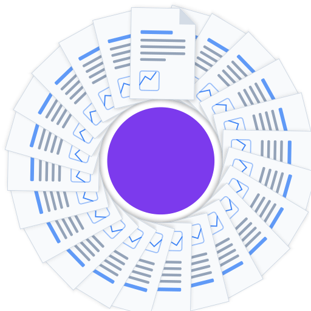
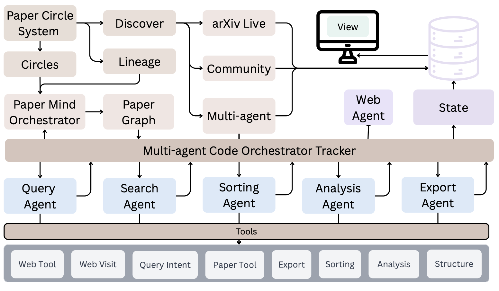
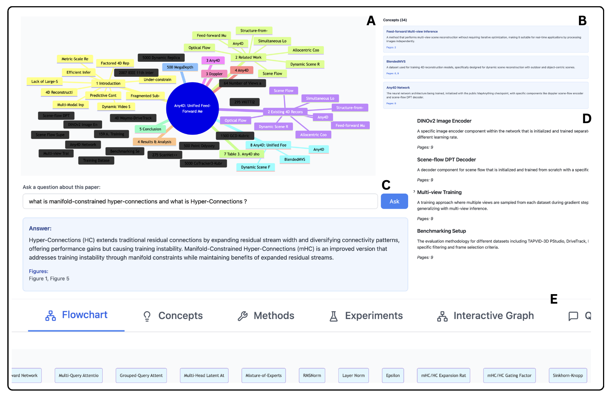

<p align="center">
  
</p>

<h1 align="center">PaperCircle</h1>

<p align="center">
  <b>An Open-source Multi-agent Research Discovery and Analysis Framework</b>
</p>

<p align="center">
  <a href="https://papercircle.vercel.app"></a>
  <a href="https://arxiv.org/abs/XXXX.XXXXX"></a>
  <a href="https://huggingface.co/spaces/ItsMaxNorm/pc-bench"></a>
  
</p>

---

> **Paper Circle: An Open-source Multi-agent Research Discovery and Analysis Framework**
>
> Komal Kumar<sup>1</sup>, Aman Chadha<sup>2</sup>, Salman Khan<sup>1</sup>, Fahad Shahbaz Khan<sup>1</sup>, Hisham Cholakkal<sup>1</sup>
>
> <sup>1</sup> Mohamed bin Zayed University of Artificial Intelligence &nbsp; <sup>2</sup> AWS Generative AI Innovation Center, Amazon Web Services
>
> [[arXiv]](https://arxiv.org/abs/XXXX.XXXXX) &nbsp; [[Live Demo]](https://papercircle.vercel.app) &nbsp; [[Benchmark]](https://huggingface.co/spaces/ItsMaxNorm/pc-bench)

---

## Architecture

<p align="center">
  
</p>

---

## Results

<p align="center">
  
</p>

Qualitative output of the Paper Mind Graph module: **(A)** Interactive mind map flowchart extracted from a paper, **(B)** Extracted concepts with descriptions and page references, **(C)** Natural language Q&A over paper content with figure references, **(D)** Detailed method and component descriptions, **(E)** Tab navigation across Flowchart, Concepts, Methods, Experiments, and Interactive Graph views.

---

## Features

- **Paper Discovery** — Multi-agent AI search across arXiv, Scopus, and IEEE with hybrid BM25 + TF-IDF ranking and three discovery modes (Stable, Discovery, Balanced)
- **Paper Mind Graph** — LLM-powered extraction of concepts, methods, and experiments into structured knowledge graphs with interactive Q&A
- **Paper Review Generation** — Conference-format reviews (ICLR/NeurIPS/ICML style) via multi-agent analysis with lineage extraction
- **Paper Lineage** — Relationship mapping (extends/applies/evaluates/contradicts/survey/prerequisite) with interactive graph visualization
- **Reading Circles** — Community-based reading groups with role-based access, session scheduling, RSVP, and discussion threads

---

## Hugging Face Resources

| Resource | Type | Link |
|----------|------|------|
| **Papers Database** | Dataset | [ItsMaxNorm/pc-database](https://huggingface.co/datasets/ItsMaxNorm/pc-database) |
| **Papers API** | Space | [ItsMaxNorm/papercircle-papers-api](https://huggingface.co/spaces/ItsMaxNorm/papercircle-papers-api) |
| **Benchmark Leaderboard** | Space | [ItsMaxNorm/pc-bench](https://huggingface.co/spaces/ItsMaxNorm/pc-bench) |
| **Benchmark Results** | Dataset | [ItsMaxNorm/pc-benchmark](https://huggingface.co/datasets/ItsMaxNorm/pc-benchmark) |
| **Research Sessions** | Dataset | [ItsMaxNorm/pc-research](https://huggingface.co/datasets/ItsMaxNorm/pc-research) |

---

## Getting Started

### Prerequisites

- **Node.js** >= 18 and **Python** >= 3.10
- A [Supabase](https://supabase.com) project
- An LLM provider: [Ollama](https://ollama.com) (local), OpenAI, or Anthropic

### Install and Run

```bash
git clone https://github.com/MAXNORM8650/papercircle.git
cd papercircle

# Install
npm install
pip install -r backend/requirements-prod.txt

# Configure
cp .env.example .env   # Edit with your Supabase & LLM credentials

# Run
npm run dev                                  # Frontend (localhost:5173)
python backend/apis/fast_discovery_api.py    # Discovery API (localhost:8000)
python backend/apis/paper_review_server.py   # Review API (localhost:8005)
python backend/apis/paper_analysis_api.py    # Analysis API (localhost:8006)
```

See [docs/QUICK_START.md](docs/QUICK_START.md) for detailed setup and [docs/DEPLOYMENT_GUIDE.md](docs/DEPLOYMENT_GUIDE.md) for production deployment.

---

## Project Structure

```
papercircle/
├── src/                                  # Frontend (React 18 + TypeScript)
│   ├── components/
│   │   ├── Papers/                       #   Paper discovery, detail, analysis views
│   │   ├── Lineage/                      #   Paper relationship graph & analysis hub
│   │   ├── Sessions/                     #   Session scheduling, RSVP, attendance
│   │   ├── Communities/                  #   Reading circle management
│   │   ├── Dashboard/                    #   User dashboard
│   │   ├── Auth/                         #   Authentication modals
│   │   ├── Layout/                       #   Header, navigation
│   │   ├── Admin/                        #   Admin panel
│   │   └── Settings/                     #   LLM & user settings
│   ├── contexts/                         #   AuthContext, CommunityContext, LineageAnalysisContext
│   ├── lib/                              #   Supabase client, API helpers, arXiv client
│   └── hooks/                            #   Custom React hooks
│
├── backend/
│   ├── agents/
│   │   ├── paper_review_agents/          #   Multi-agent review generation & benchmarking
│   │   │   ├── orchestrator.py           #     Agent orchestration pipeline
│   │   │   ├── specialized_agents.py     #     Critic, Literature, Reproducibility agents
│   │   │   ├── benchmark_framework.py    #     Review benchmark framework
│   │   │   ├── benchmark_paper_review.py #     Benchmark CLI
│   │   │   ├── evaluation_metrics.py     #     MSE, MAE, correlation, accuracy metrics
│   │   │   └── benchmark_results/        #     Cached benchmark outputs
│   │   ├── paper_mind_graph/             #   Knowledge graph extraction from PDFs
│   │   │   ├── graph_builder.py          #     LLM-based concept/method extraction
│   │   │   ├── qa_system.py              #     Interactive Q&A over papers
│   │   │   ├── ingestion.py              #     PDF parsing & chunking
│   │   │   └── export.py                 #     JSON/Markdown/Mermaid/HTML export
│   │   ├── discovery/                    #   Paper discovery agents & ranking
│   │   └── agents/                       #   Core query & research agents
│   ├── apis/
│   │   ├── fast_discovery_api.py         #   Discovery API (port 8000)
│   │   ├── paper_review_server.py        #   Review API (port 8005)
│   │   ├── paper_analysis_api.py         #   Analysis API (port 8006)
│   │   ├── community_papers_api.py       #   Community papers API
│   │   ├── research_pipeline_api.py      #   Research pipeline API
│   │   └── unified/                      #   Unified Docker API (app.py + routers/)
│   ├── core/                             #   paperfinder.py, discovery_papers.py
│   ├── services/                         #   HuggingFace papers client
│   └── utils/                            #   Storage utilities
│
├── supabase/
│   ├── migrations/                       #   55 SQL migrations (schema, RLS, seeds)
│   └── functions/                        #   Edge functions (arxiv-search)
│
├── api/                                  # Vercel serverless functions
│   ├── arxiv.js                          #   arXiv CORS proxy
│   ├── community-papers.js              #   Community papers endpoint
│   └── sync-status.js                   #   Sync status endpoint
│
├── scripts/                              # Utility scripts
│   ├── javascript/                       #   arxiv-proxy, search engine, test scripts
│   ├── shell/                            #   Start scripts for each API service
│   └── *.py                              #   Dataset builder, sync, DB fixes
│
├── docs/                                 # Documentation
│   ├── BENCHMARKS.md                     #   Benchmark guide (review + retrieval)
│   ├── QUICK_START.md                    #   Quick start guide
│   ├── DEPLOYMENT_GUIDE.md              #   Production deployment
│   ├── SECURITY.md                       #   Security guidelines
│   ├── MIGRATION_COMPLETE.md            #   Serverless migration summary
│   └── PAPER_REVIEW_AGENTS_IMPLEMENTATION.md  # Review system implementation
│
├── examples/
│   ├── pc-data/                          #   Benchmark datasets
│   └── docs/                             #   Architecture & integration guides
│       ├── ARCHITECTURE_DIAGRAMS.md      #     System diagrams
│       ├── MULTI_AGENT_PIPELINE_ARCHITECTURE.md
│       ├── ORCHESTRATOR_ARCHITECTURE.md
│       ├── PAPER_MIND_GRAPH_ARCHITECTURE.md
│       ├── AGENT_OPTIMIZATION_GUIDE.md
│       ├── RERANKER_INTEGRATION_SUMMARY.md
│       └── setup/                        #     Module setup & integration guides
│
├── hf_spaces/                            # HuggingFace Spaces (Papers API app)
├── assets/                               # Architecture & results figures
└── public/                               # Logo and static assets
```

---

## Benchmarks

Two evaluation suites: **Review Quality** (AI reviews vs human reviewers) and **Retrieval Quality** (paper search accuracy).

| Benchmark | Metrics | Conferences | Details |
|-----------|---------|-------------|---------|
| **Paper Review** | MSE, MAE, Pearson r, Spearman ρ, Accuracy ±0.5/1.0/1.5 | ICLR, NeurIPS, ICML | [docs/BENCHMARKS.md](docs/BENCHMARKS.md) |
| **Retrieval** | Recall@k, MRR, Success Rate | 30+ conferences | [docs/BENCHMARKS.md](docs/BENCHMARKS.md) |

```bash
# Review benchmark
python backend/agents/paper_review_agents/benchmark_paper_review.py \
  --data iclr2024.json --conference iclr --limit 100

# Retrieval benchmark
python benchmark_multiagent.py --queries queries.json --baseline bm25+reranker
```

Model results: [ItsMaxNorm/pc-benchmark](https://huggingface.co/datasets/ItsMaxNorm/pc-benchmark) &nbsp; Interactive leaderboard: [ItsMaxNorm/pc-bench](https://huggingface.co/spaces/ItsMaxNorm/pc-bench)

---

## Citation

If you find PaperCircle useful in your research, please cite our paper:

```bibtex
@article{kumar2025papercircle,
  title={Paper Circle: An Open-source Multi-agent Research Discovery and Analysis Framework},
  author={Kumar, Komal and Chadha, Aman and Khan, Salman and Khan, Fahad Shahbaz and Cholakkal, Hisham},
  journal={arXiv preprint arXiv:XXXX.XXXXX},
  year={2025}
}
```

---

## License

MIT License — see [LICENSE](LICENSE)

## Acknowledgments

[arXiv](https://arxiv.org) &bull; [Supabase](https://supabase.com) &bull; [smolagents](https://github.com/huggingface/smolagents) &bull; [LiteLLM](https://github.com/BerriAI/litellm) &bull; [Ollama](https://ollama.com) &bull; [Hugging Face](https://huggingface.co)
