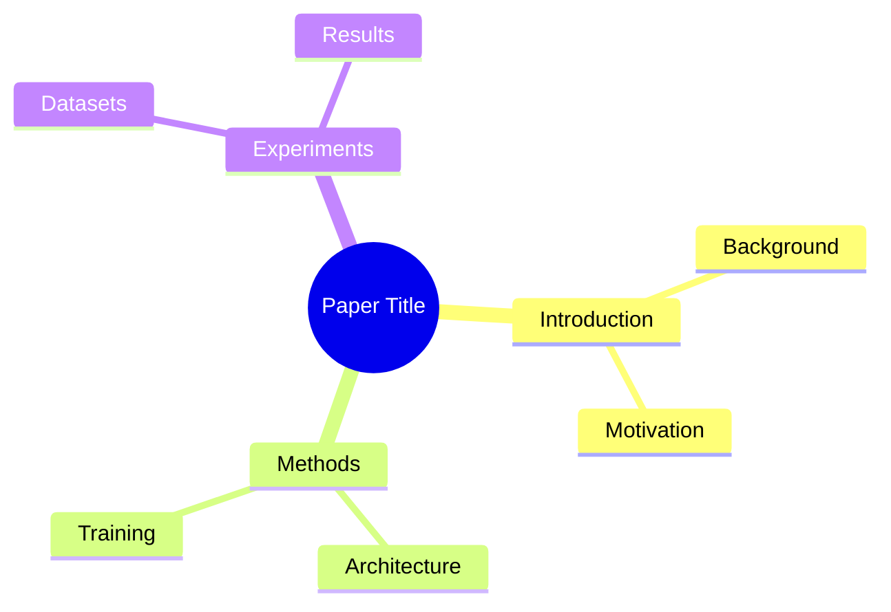

# 🧠 Paper Mind Graph

[](https://www.python.org/downloads/)
[](https://github.com/huggingface/smolagents)
[](https://opensource.org/licenses/MIT)

**Transform research papers into interactive, traceable knowledge graphs.**

Build mind maps from PDFs with automatic extraction of concepts, methods, experiments, figures, and tables. Every node links back to the original text. Ask questions, verify coverage, and export to multiple formats.

## ✨ Features

| Feature | Description |
|---------|-------------|
| 📥 **Smart Ingestion** | PDF parsing with structure extraction (sections, figures, tables, equations) |
| 🧩 **Semantic Chunking** | Structure-aware chunking by paragraphs and sections |
| 🗺️ **Mind Graph** | Typed nodes (Concept, Method, Experiment) with typed edges |
| 🔗 **Full Traceability** | Every node links to original PDF page and text |
| ✅ **Coverage Checks** | Verify all figures/tables/sections are represented |
| 👤 **Human Editing** | Add/edit/verify nodes and edges |
| 🤖 **Q&A System** | Graph-aware RAG for answering questions |
| 📤 **Multi-Format Export** | JSON, Markdown, Mermaid, interactive HTML |

## 🚀 Quick Start

```bash
# Install
pip install -r requirements.txt

# Create mind graph from paper
python -m paper_mind_graph https://arxiv.org/abs/2312.00752 -o ./output
```

### Python API

```python
from paper_mind_graph import PaperMindGraph

# Load paper (URL or local path)
pmg = PaperMindGraph("https://arxiv.org/abs/2312.00752")

# Ask questions
answer = pmg.ask("What is the main contribution of this paper?")
print(answer)

# Find where something is discussed
location = pmg.locate("attention mechanism")
print(f"Found on pages: {location['locations'][0]['pages']}")

# Get extracted concepts
concepts = pmg.get_concepts()
for c in concepts[:5]:
    print(f"- {c['title']}: {c['description'][:50]}...")

# Check coverage
report = pmg.check_coverage()
print(f"Coverage: {report.get_coverage_score()}%")

# Export
pmg.export("markdown", "paper_notes.md")
pmg.export("mermaid-flowchart", "concepts.mermaid")
pmg.export("html", "interactive_graph.html")
```

## 🏗️ Architecture

```
┌──────────────────────────────────────────────────────────────────────────┐
│                            Paper Mind Graph                               │
├──────────────────────────────────────────────────────────────────────────┤
│                                                                          │
│  ┌─────────────┐    ┌─────────────┐    ┌─────────────┐    ┌───────────┐ │
│  │  INGESTION  │───▶│   CHUNKING  │───▶│   GRAPH     │───▶│  Q&A /    │ │
│  │             │    │             │    │   BUILDER   │    │  EXPORT   │ │
│  └─────────────┘    └─────────────┘    └─────────────┘    └───────────┘ │
│        │                  │                  │                   │      │
│        ▼                  ▼                  ▼                   ▼      │
│  ┌─────────────┐    ┌─────────────┐    ┌─────────────┐    ┌───────────┐ │
│  │ • PDF Parse │    │ • Paragraph │    │ • Concepts  │    │ • RAG     │ │
│  │ • Sections  │    │ • Figures   │    │ • Methods   │    │ • Locate  │ │
│  │ • Figures   │    │ • Tables    │    │ • Expmnts   │    │ • Export  │ │
│  │ • Tables    │    │ • Equations │    │ • Links     │    │ • Verify  │ │
│  └─────────────┘    └─────────────┘    └─────────────┘    └───────────┘ │
│                                                                          │
└──────────────────────────────────────────────────────────────────────────┘
```

## 📊 Graph Schema

### Node Types

| Type | Description | Example |
|------|-------------|---------|
| `paper` | Root node | "Attention Is All You Need" |
| `section` | Paper section | "3.1 Attention Mechanism" |
| `concept` | Key idea/definition | "Multi-Head Attention" |
| `method` | Algorithm/technique | "Transformer Architecture" |
| `experiment` | Experimental setup | "Machine Translation Evaluation" |
| `figure` | Figure with caption | "Figure 2: Model Architecture" |
| `table` | Table with caption | "Table 1: BLEU Scores" |
| `equation` | Numbered equation | "Equation (1)" |
| `dataset` | Dataset mentioned | "WMT 2014" |
| `result` | Specific finding | "BLEU score of 28.4" |

### Edge Types

| Type | Meaning | Example |
|------|---------|---------|
| `has_section` | Paper → Section | Paper → Introduction |
| `defines` | Section → Concept | Section 3 → "Attention" |
| `proposes` | Paper → Method | Paper → "Transformer" |
| `uses_method` | Experiment → Method | MT Eval → Transformer |
| `illustrated_by` | Concept → Figure | Architecture → Figure 1 |
| `summarized_by` | Results → Table | BLEU → Table 2 |
| `depends_on` | Concept → Concept | Multi-Head → Self-Attention |
| `evaluates_on` | Experiment → Dataset | Training → WMT 2014 |

## 📖 Detailed Usage

### Configuration

```python
from paper_mind_graph import PaperMindGraph, Config

config = Config(
    # LLM settings (using local Ollama)
    api_base="http://localhost:11434",
    model_id="ollama_chat/qwen3-coder:30b",
    num_ctx=8192,
    
    # Processing
    cache_dir="./cache",
    max_chunk_size=1500,
    
    # What to extract
    extract_concepts=True,
    extract_methods=True,
    extract_experiments=True,
    link_figures=True,
    # Q&A
    top_k_retrieval=5
)

pmg = PaperMindGraph("paper.pdf", config=config)
```

### Interactive Q&A Session

```python
# Start interactive session
session = pmg.start_session()

# Ask multiple questions
print(session.ask("What datasets are used?"))
print(session.ask("How does this compare to BERT?"))
print(session.locate("Table 3"))

# Get conversation history
history = session.get_history()
```

### Coverage Verification

```python
# Get detailed coverage report
report = pmg.check_coverage()

# Print as markdown
print(report.to_markdown())

# Check specific issues
print(f"Coverage Score: {report.get_coverage_score()}%")
print(f"Unlinked Figures: {[f.label for f in report.figures if f.status == 'unlinked']}")
print(f"Critical Issues: {report.critical_issues}")
```

### Human Verification & Editing

```python
# Mark a node as verified
pmg.verify_node("concept_abc123")

# Edit a node
pmg.edit_node("concept_abc123", 
              title="Self-Attention Mechanism",
              description="Updated description...")

# Add a new link
pmg.add_link("concept_abc123", "fig_1", "illustrated_by", 
             reason="Figure shows attention weights")

# Remove a link
pmg.remove_link("edge_xyz789")

# Get unverified nodes
unverified = pmg.get_unverified()
```

### Export Formats

```python
# JSON (full graph data)
pmg.export("json", "graph.json")

# Markdown (structured notes)
pmg.export("markdown", "notes.md")
pmg.export("markdown-outline", "outline.md")

# Mermaid (for diagrams)
pmg.export("mermaid-mindmap", "mindmap.mermaid")
pmg.export("mermaid-flowchart", "flowchart.mermaid")

# Interactive HTML (D3.js visualization)
pmg.export("html", "interactive.html")

# Export all formats at once
pmg.export_all("./exports/")
```

### Save & Load

```python
# Save graph for later
pmg.save("paper_graph.json")

# Load saved graph
pmg2 = PaperMindGraph.load("paper_graph.json")
```

## 🔧 Module Reference

### `schema.py` - Data Models
- `MindGraph` - Main graph container
- `GraphNode`, `GraphEdge` - Graph elements
- `NodeType`, `EdgeType` - Type enums
- `Section`, `Figure`, `Table`, `Equation` - Paper structure

### `ingestion.py` - PDF Processing
- `PDFParser` - Extract text and structure from PDFs
- `SemanticChunker` - Create meaningful chunks
- `IngestionPipeline` - Complete ingestion workflow

### `graph_builder.py` - LLM Extraction
- `ConceptExtractor` - Extract key concepts
- `MethodExtractor` - Extract methods/algorithms
- `ExperimentExtractor` - Extract experiments
- `LinkageAgent` - Link figures/tables to concepts
- `GraphBuilder` - Orchestrate extraction

### `verification.py` - Coverage & Verification
- `CoverageChecker` - Check graph completeness
- `VerificationManager` - Human verification workflow
- `CoverageReport` - Detailed coverage metrics

### `qa_system.py` - Q&A
- `EmbeddingStore` - Vector storage for retrieval
- `GraphRetriever` - Graph-aware retrieval
- `PaperQA` - Question answering
- `QASession` - Interactive session

### `export.py` - Export Formats
- `JSONExporter`, `MarkdownExporter`
- `MermaidExporter`, `HTMLExporter`
- `GraphExporter` - Unified exporter

### `api.py` - Main API
- `PaperMindGraph` - High-level interface
- `Config` - Configuration options

## 📦 Requirements

```
smolagents>=1.0.0
litellm>=1.0.0
pymupdf>=1.23.0
requests>=2.28.0
numpy>=1.24.0
sentence-transformers>=2.2.0  # optional, for better embeddings
```

## 🔬 Example Output

### Mermaid Mind Map


### Coverage Report
```
# Coverage Report

**Overall Coverage Score: 85%**

| Category | Coverage |
|----------|----------|
| Figures | 4/5 |
| Tables | 3/3 |
| Sections with Concepts | 8/10 |

## ⚠️ Warnings
- Figure 5 has no linked concepts
- Section 4.3 has no extracted concepts
```

## 🤝 Contributing

Contributions welcome! Key areas:
- Better PDF parsing for complex layouts
- Additional LLM backends
- Visualization improvements
- Citation network analysis
- Batch processing

## 📝 License

MIT License

---

Made for researchers who want to understand papers deeply 📚
