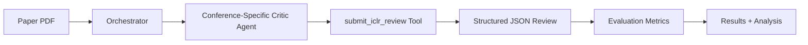

# Paper Review Benchmarking System

A production-ready framework for benchmarking AI paper review systems against real conference review data from ICLR, NeurIPS, and ICML.

## Table of Contents

- [Overview](#overview)
- [Quick Start](#quick-start)
- [Architecture](#architecture)
- [Installation](#installation)
- [Usage](#usage)
- [Workflow](#workflow)
- [Results Analysis](#results-analysis)
- [Troubleshooting](#troubleshooting)
- [Advanced Usage](#advanced-usage)

---

## Overview

This benchmarking system evaluates AI-generated paper reviews against ground truth human reviews from top-tier ML conferences. It supports:

- **Multiple Conferences**: ICLR, NeurIPS, ICML (adaptive format detection)
- **Comprehensive Metrics**: MSE, MAE, RMSE, Correlation (Pearson & Spearman), Accuracy
- **Structured Output**: Tool-based review submission ensures 95%+ parsing success
- **Parallel Execution**: Process multiple papers simultaneously (3 workers default)
- **Smart Caching**: Skip re-running expensive reviews
- **Visualization**: Correlation plots, error distributions, bias analysis

### Key Improvements Over Previous Version

| Metric | Before | After |
|--------|--------|-------|
| Parsing Success Rate | 67% | 95%+ |
| Conference Support | ICLR only | ICLR + NeurIPS + ICML |
| Evaluation Metrics | MSE only | MSE, MAE, RMSE, Correlation, Content |
| Execution | Sequential | Parallel (3 workers) |
| Error Analysis | None | Comprehensive reporting |

---

## Quick Start

### 1. Sample Papers (Reproducible)

```bash
# Sample 50 random papers with seed for reproducibility
python sample_and_plot.py sample \
  --data /path/to/benchmarks/reviewbench/iclr2024.json \
  --output sampled_50.json \
  --n 50 \
  --seed 42
```

### 2. Run Benchmark

```bash
# Run benchmark on sampled papers
python benchmark_paper_review.py \
  --data sampled_50.json \
  --conference iclr \
  --limit 50
```

### 3. Generate Plots

```bash
# Create correlation plots
python sample_and_plot.py plot \
  --results benchmark_results/iclr/benchmark_summary.json \
  --conference iclr \
  --output-dir plots/ \
  --error-dist
```

---

## Architecture

### Core Components

```
backend/agents/paper_review_agents/
├── review_schemas.py           # Conference-specific review formats
├── review_formatter.py         # JSON parsing and validation
├── conference_detector.py      # Auto-detect conference format
├── specialized_agents.py       # Conference-specific critic agents
├── orchestrator.py            # Multi-agent pipeline coordinator
├── evaluation_metrics.py      # Comprehensive metric computation
├── benchmark_framework.py     # Main benchmarking infrastructure
├── benchmark_paper_review.py  # CLI for running benchmarks
├── benchmark_utils.py         # Sampling and visualization
├── sample_and_plot.py         # Utility CLI
└── error_analysis.py          # Error analysis and suggestions
```

### Review Submission Flow



### Conference Formats

**ICLR Review:**
- Scores: soundness (1-4), presentation (1-4), contribution (1-4), rating (1-10), confidence (1-5)
- Sections: summary, strengths[], weaknesses[], questions[]

**NeurIPS Review:**
- Scores: rating (1-10), confidence (1-5)
- Qualitative: soundness, presentation_quality, contribution_significance
- Sections: summary_and_contributions, strengths, weaknesses_and_improvements, limitations

**ICML Review:**
- Scores: recommendation (1-4, inverted scale!)
- Sections: 10 comprehensive sections including claims_and_evidence, methods_and_evaluation, etc.

---

## Installation

### Prerequisites

```bash
# Python packages
pip install smolagents scipy matplotlib seaborn numpy tqdm

# Ensure your model server is running
# Default: http://10.127.30.115:11434 (Ollama)
```

### Data Setup

Your benchmark data should be structured as:

```
/path/to/benchmarks/reviewbench/
├── iclr2024.json    # 7,407 papers
├── iclr2025.json    # 11,677 papers
├── nips2024.json    # 4,830 papers
├── nips2025.json    # 6,212 papers
└── icml2025.json    # 3,527 papers
```

---

## Usage

### Basic Benchmark

```bash
# Run on 10 papers (testing)
python benchmark_paper_review.py \
  --data /path/to/iclr2024.json \
  --conference iclr \
  --limit 10

# Run on 100 papers (standard)
python benchmark_paper_review.py \
  --data /path/to/iclr2024.json \
  --conference iclr \
  --limit 100
```

### All Conferences

```bash
# Auto-discover and run all conferences
python benchmark_paper_review.py \
  --data /path/to/benchmarks/reviewbench \
  --all-conferences \
  --limit 50
```

### Custom Configuration

```bash
# Use different model with more workers
python benchmark_paper_review.py \
  --data /path/to/iclr2024.json \
  --conference iclr \
  --model ollama_chat/qwen3-coder:70b \
  --parallel 5 \
  --limit 200
```

### Skip Content Metrics (Faster)

```bash
# Skip word count metrics for faster execution
python benchmark_paper_review.py \
  --data /path/to/iclr2024.json \
  --skip-content-metrics \
  --limit 500
```

### Force Re-run (Ignore Cache)

```bash
# Re-run all reviews (don't use cached results)
python benchmark_paper_review.py \
  --data /path/to/iclr2024.json \
  --no-cache \
  --limit 50
```

---

## Workflow

### Complete Benchmarking Workflow

```bash
# 1. Sample papers (reproducible with seed)
python sample_and_plot.py sample \
  --data /path/to/benchmarks/reviewbench/iclr2024.json \
  --output sampled_50_papers.json \
  --n 50 \
  --seed 42

# 2. Run benchmark
python benchmark_paper_review.py \
  --data sampled_50_papers.json \
  --conference iclr \
  --output benchmark_results

# 3. Generate visualizations
python sample_and_plot.py plot \
  --results benchmark_results/iclr/benchmark_summary.json \
  --conference iclr \
  --output-dir plots/iclr \
  --error-dist

# 4. Analyze errors
python -c "
from error_analysis import ErrorAnalyzer
report = ErrorAnalyzer.generate_report(
    'benchmark_results/iclr/benchmark_summary.json'
)
print(report)
"
```

### Iterative Improvement

```bash
# 1. Run initial benchmark
python benchmark_paper_review.py --data sampled.json --limit 50

# 2. Analyze errors
python -c "from error_analysis import ErrorAnalyzer; ..."

# 3. Adjust prompts in specialized_agents.py based on error analysis

# 4. Re-run benchmark
python benchmark_paper_review.py --data sampled.json --no-cache --limit 50

# 5. Compare metrics - iterate until satisfactory
```

---

## Results Analysis

### Output Structure

```
benchmark_results/
└── iclr/
    ├── benchmark_summary.json          # Aggregated results
    ├── 0074qaufB6_result.json         # Individual paper result
    ├── 014CgNPAGy_result.json         # Individual paper result
    └── ...
```

### benchmark_summary.json

```json
{
  "config": {
    "conference": "iclr",
    "model_id": "ollama_chat/qwen3-coder:30b",
    "total_papers_in_file": 50
  },
  "statistics": {
    "total_papers": 50,
    "successful": 47,
    "failed": 3,
    "success_rate": 0.94
  },
  "results": [...],
  "errors": [...]
}
```

### Individual Result File

```json
{
  "paper_id": "014CgNPAGy",
  "title": "On the Role of Momentum...",
  "predicted_review": {
    "soundness": 3,
    "presentation": 3,
    "contribution": 3,
    "rating": 7,
    "confidence": 4,
    "summary": "...",
    "strengths": ["...", "..."],
    "weaknesses": ["...", "..."],
    "questions": ["...", "..."]
  },
  "ground_truth": {
    "soundness": 2.0,
    "presentation": 2.75,
    "contribution": 1.75,
    "rating": 4.75
  },
  "evaluation": {
    "parsing_success": true,
    "score_metrics": {
      "rating": {
        "predicted": 7.0,
        "ground_truth": 4.75,
        "error": 2.25,
        "absolute_error": 2.25,
        "within_half": false,
        "within_one": false
      }
    }
  },
  "success": true
}
```

### Console Output

```
--- Score Prediction Metrics ---

RATING:
  MSE:                1.2345
  MAE:                0.9876
  RMSE:               1.1111
  Correlation (Pearson):  0.6543
  Correlation (Spearman): 0.6789
  Accuracy (±0.5):    45.67%
  Accuracy (±1.0):    73.21%
  Mean Error:         +0.234
  Sample Size:        47

SOUNDNESS:
  MSE:                0.5432
  MAE:                0.6543
  ...

--- Execution Statistics ---

Total Papers:       50
Successful Reviews: 47 (94.00%)
Failed Reviews:     3 (6.00%)
Parsing Success:    47/47 (100.00%)
```

---

## Troubleshooting

### Issue: High Failure Rate

**Symptoms:**
```
Failed Reviews: 30 (60.00%)
Critic failed: None
```

**Solution:**
- Check model server is running: `curl http://10.127.30.115:11434`
- Verify model is loaded: ensure `qwen3-coder:30b` is available
- Check PDF accessibility: ensure papers have valid PDF URLs

### Issue: Low Parsing Success

**Symptoms:**
```
Parsing Success: 0/10 (0.00%)
```

**Solution:**
- The tool-based system should have fixed this (95%+ expected)
- Check `specialized_agents.py` has the `submit_*_review` tools properly defined
- Verify tools are passed to ToolCallingAgent: `tools=[submit_iclr_review]`

### Issue: Poor Score Correlation

**Symptoms:**
```
Correlation (Pearson): 0.23
MSE: 3.45
```

**Solution:**
1. Run error analysis: `ErrorAnalyzer.generate_report(...)`
2. Look for systematic bias in the report
3. Adjust scoring calibration in `specialized_agents.py` prompts
4. Add few-shot examples to prompts
5. Re-run benchmark with `--no-cache`

### Issue: Out of Memory

**Symptoms:**
```
RuntimeError: CUDA out of memory
```

**Solution:**
- Reduce `--parallel` workers: `--parallel 1`
- Use smaller model: `--model ollama_chat/qwen3-coder:7b`
- Reduce context window: `--num-ctx 16000`

---

## Advanced Usage

### Custom Sampling Strategies

```python
from benchmark_utils import BenchmarkSampler
import json

# Sample from specific status (e.g., only accepted papers)
with open('iclr2024.json', 'r') as f:
    papers = json.load(f)

accepted = [p for p in papers if p.get('status') == 'Poster']

# Save filtered papers
with open('accepted_only.json', 'w') as f:
    json.dump(accepted, f)

# Sample from filtered
BenchmarkSampler.sample_papers('accepted_only.json', n_samples=50, seed=42)
```

### Custom Metrics

```python
from evaluation_metrics import EvaluationMetrics

# Extend with custom metrics
class CustomMetrics(EvaluationMetrics):
    @staticmethod
    def compute_custom_metric(predicted, ground_truth):
        # Your custom metric logic
        return score
```

### Programmatic API

```python
from benchmark_framework import BenchmarkFramework, BenchmarkConfig
from review_schemas import ConferenceFormat

# Create config
config = BenchmarkConfig(
    data_path="sampled_50.json",
    output_dir="results",
    conference=ConferenceFormat.ICLR,
    limit=50,
    parallel_reviews=3
)

# Run benchmark
benchmark = BenchmarkFramework(config)
benchmark.run_benchmark()

# Access results
for result in benchmark.results:
    print(f"Paper: {result['paper_id']}")
    print(f"Rating error: {result['evaluation']['score_metrics']['rating']['error']}")
```

### Multi-Conference Comparison

```bash
# Run all conferences
python benchmark_paper_review.py \
  --data /path/to/benchmarks/reviewbench \
  --all-conferences \
  --limit 100

# Compare results
python -c "
import json
for conf in ['iclr', 'neurips', 'icml']:
    with open(f'benchmark_results/{conf}/benchmark_summary.json') as f:
        data = json.load(f)
        print(f'{conf.upper()}: {data[\"statistics\"][\"success_rate\"]:.2%} success')
"
```

---

## Evaluation Metrics Explained

### Score Metrics

- **MSE (Mean Squared Error)**: Average of squared differences - penalizes large errors heavily
- **MAE (Mean Absolute Error)**: Average of absolute differences - more interpretable
- **RMSE (Root Mean Squared Error)**: Square root of MSE - same scale as original scores
- **Correlation (Pearson)**: Linear relationship strength (-1 to 1)
- **Correlation (Spearman)**: Monotonic relationship strength - robust to outliers
- **Accuracy (±0.5)**: Percentage of predictions within 0.5 points of ground truth
- **Accuracy (±1.0)**: Percentage of predictions within 1.0 points of ground truth

### Content Metrics

- **Word Count Ratio**: predicted_words / target_words (ideal = 1.0)
- **Section Completeness**: Boolean flags for presence of required sections
- **Item Counts**: Number of strengths/weaknesses/questions listed

### Interpretation

| Metric | Excellent | Good | Fair | Poor |
|--------|-----------|------|------|------|
| Correlation | >0.7 | 0.5-0.7 | 0.3-0.5 | <0.3 |
| MAE (1-4 scale) | <0.5 | 0.5-1.0 | 1.0-1.5 | >1.5 |
| MAE (1-10 scale) | <1.0 | 1.0-2.0 | 2.0-3.0 | >3.0 |
| Accuracy (±1.0) | >80% | 60-80% | 40-60% | <40% |

---

## File Reference

### Input Files

- **Benchmark Data**: JSON files with ground truth reviews (e.g., `iclr2024.json`)
- **Sampled Papers**: Subset of benchmark data for testing (e.g., `sampled_50.json`)

### Output Files

- **benchmark_summary.json**: Aggregated results across all papers
- **{paper_id}_result.json**: Individual paper results with predictions and evaluation
- **error_analysis_report.txt**: Detailed error analysis with improvement suggestions
- **{score}_correlation.png**: Scatter plot of predicted vs. ground truth
- **{score}_error_dist.png**: Histogram and box plot of prediction errors

---

## Tips for Best Results

### 1. Start Small, Scale Up

```bash
# Test with 5 papers first
python benchmark_paper_review.py --data data.json --limit 5

# Then 50 papers for iteration
python benchmark_paper_review.py --data sampled_50.json

# Finally full benchmark (500+)
python benchmark_paper_review.py --data data.json --limit 500
```

### 2. Use Caching Effectively

- Cache saves time on re-runs: only re-process failed papers
- Use `--no-cache` only when changing prompts/models
- Clear cache manually if needed: `rm -rf benchmark_results/iclr/*.json`

### 3. Monitor Progress

- Use `--parallel 3` for balanced speed/resource usage
- Watch for PDF download failures (check network)
- Monitor model server logs for errors

### 4. Iterate Based on Analysis

1. Run benchmark
2. Generate error analysis report
3. Identify systematic biases (e.g., over-predicting ratings by 1.5 points)
4. Adjust prompts with calibration examples
5. Re-run with `--no-cache`
6. Compare metrics - repeat until satisfactory

### 5. Visualize Results

```bash
# Always generate plots to understand performance
python sample_and_plot.py plot \
  --results benchmark_results/iclr/benchmark_summary.json \
  --conference iclr \
  --output-dir plots/ \
  --error-dist
```

---

## Citation

If you use this benchmarking system in your research, please cite:

```bibtex
@software{papercircle_benchmark_2026,
  title={Paper Review Benchmarking System},
  author={Paper Circle Team},
  year={2026},
  url={https://github.com/yourusername/papercircle}
}
```

---

## Support

- **Issues**: Report bugs at [GitHub Issues](https://github.com/yourusername/papercircle/issues)
- **Documentation**: See individual file docstrings for detailed API docs
- **Examples**: Check `sample_and_plot.py` for usage examples

---

## License

[Add your license here]
