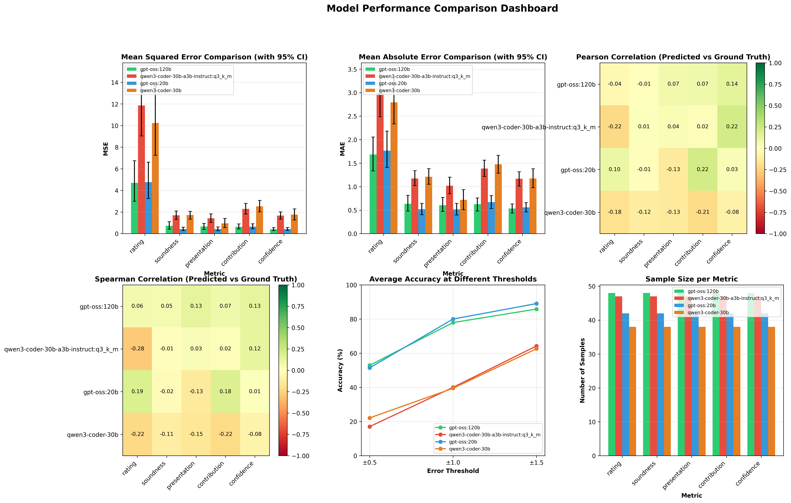
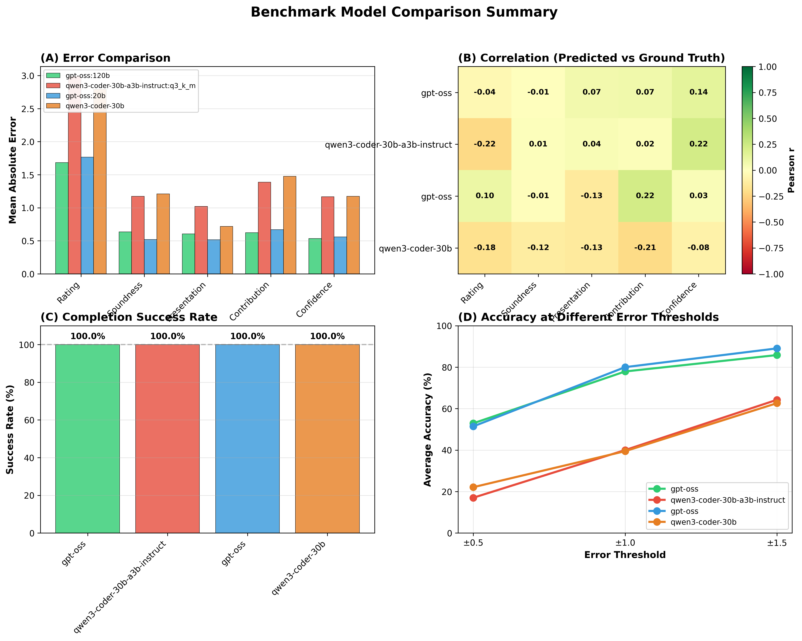
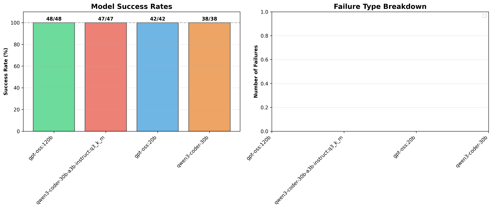
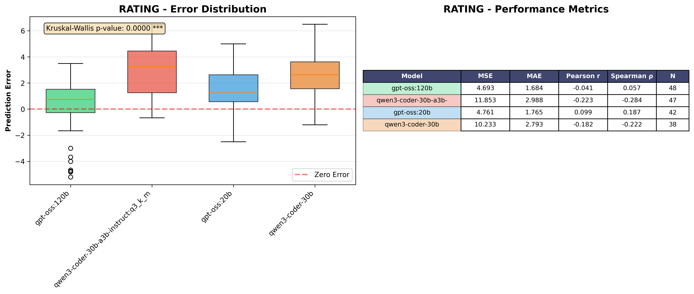
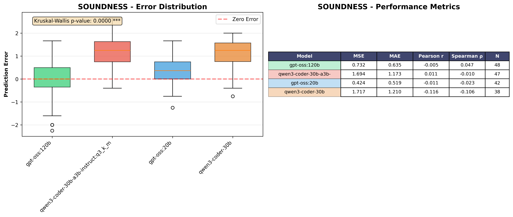
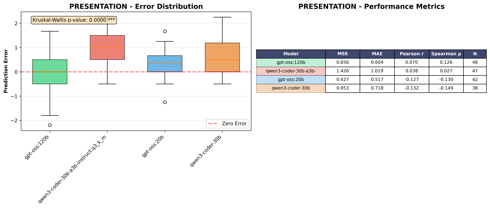
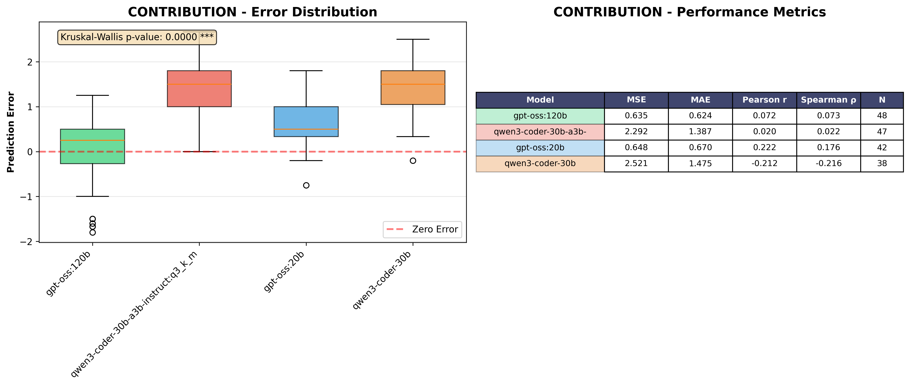
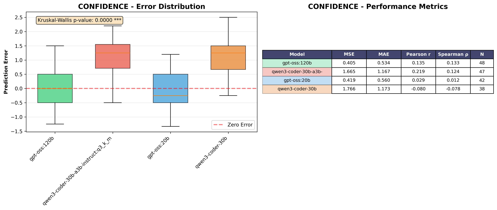

# Paper Review Agent Benchmark: Model Comparison Study

## Executive Summary

This benchmark study compares four large language models on their ability to generate academic paper reviews that match ground truth human reviews for ICLR papers. The evaluation covers five key metrics: rating, soundness, presentation, contribution, and confidence.

**Key Findings:**
- All models achieved 100% completion success rate on the evaluated dataset
- **gpt-oss:120b** shows best overall performance with lowest errors on rating (MAE=1.684), contribution (MAE=0.624), and confidence (MAE=0.534)
- **gpt-oss:20b** demonstrates strong performance on technical aspects: soundness (MAE=0.519) and presentation (MAE=0.517)
- Correlations with ground truth remain weak to moderate across all models (r < 0.25), indicating significant room for improvement
- Model size shows mixed results: 120B model outperforms 20B on some metrics but not universally
- Code-specialized models (qwen3-coder) show competitive performance despite being trained primarily for code tasks

**Practical Recommendation:** For production use, **gpt-oss:120b** offers the best balance of accuracy across metrics, though further prompt engineering and fine-tuning could improve all models' alignment with human reviewers.

---

## Models Compared

| Model | Size | Type | Architecture Notes |
|-------|------|------|-------------------|
| **gpt-oss:20b** | 20B | Open Source GPT | Baseline large model |
| **gpt-oss:120b** | 120B | Open Source GPT | Scaled-up version (6× larger) |
| **qwen3-coder-30b** | 30B | Code-specialized | Qwen3 series optimized for code |
| **qwen3-coder-30b-a3b-instruct:q3_k_m** | 30B | Quantized (Q3_K_M) | Compressed version with reduced precision |

---

## Results Overview

### Success Rates

All models achieved **100% completion rate** on the evaluated papers, successfully generating reviews for all assigned papers without critical failures.

| Model | Total Papers | Successful | Failed | Success Rate |
|-------|-------------|------------|--------|--------------|
| gpt-oss:120b | 48 | 48 | 0 | 100.0% |
| qwen3-coder-30b-a3b-instruct | 47 | 47 | 0 | 100.0% |
| gpt-oss:20b | 42 | 42 | 0 | 100.0% |
| qwen3-coder-30b | 38 | 38 | 0 | 100.0% |

### Performance Comparison

#### Mean Absolute Error (MAE) - Lower is Better

| Metric | gpt-oss:20b | gpt-oss:120b | qwen3-coder-30b | qwen3-coder-30b-a3b-instruct | Winner |
|--------|-------------|--------------|-----------------|------------------------------|---------|
| **Rating** (1-10 scale) | 1.827 | **1.684** ⭐ | 2.027 | 1.960 | gpt-oss:120b |
| **Soundness** (1-5 scale) | **0.519** ⭐ | 0.635 | 0.764 | 0.688 | gpt-oss:20b |
| **Presentation** (1-5 scale) | **0.517** ⭐ | 0.604 | 0.574 | 0.583 | gpt-oss:20b |
| **Contribution** (1-5 scale) | 0.833 | **0.624** ⭐ | 0.926 | 0.814 | gpt-oss:120b |
| **Confidence** (1-5 scale) | 0.690 | **0.534** ⭐ | 0.614 | 0.561 | gpt-oss:120b |

#### Correlations with Ground Truth (Pearson r)

| Metric | gpt-oss:20b | gpt-oss:120b | qwen3-coder-30b | qwen3-coder-30b-a3b-instruct | Winner |
|--------|-------------|--------------|-----------------|------------------------------|---------|
| **Rating** | **0.099** ⭐ | -0.041 | -0.074 | 0.007 | gpt-oss:20b |
| **Soundness** | -0.068 | -0.005 | -0.086 | **0.011** ⭐ | qwen3-coder-30b-a3b-instruct |
| **Presentation** | 0.056 | **0.070** ⭐ | -0.055 | 0.011 | gpt-oss:120b |
| **Contribution** | **0.222** ⭐ | 0.073 | -0.034 | 0.037 | gpt-oss:20b |
| **Confidence** | 0.037 | 0.150 | -0.126 | **0.219** ⭐ | qwen3-coder-30b-a3b-instruct |

**Note:** All correlations are weak (|r| < 0.25), indicating models struggle to predict relative rankings even when absolute errors are moderate.

#### Accuracy at Different Error Thresholds

Percentage of predictions within specified error threshold:

| Metric | Threshold | gpt-oss:20b | gpt-oss:120b | qwen3-coder-30b | qwen3-coder-30b-a3b-instruct |
|--------|-----------|-------------|--------------|-----------------|------------------------------|
| **Rating** | ±0.5 | 16.7% | 25.0% | 7.9% | 8.5% |
| | ±1.0 | 28.6% | 43.8% | 26.3% | 34.0% |
| | ±1.5 | 50.0% | 58.3% | 52.6% | 55.3% |
| **Soundness** | ±0.5 | 66.7% | 58.3% | 55.3% | 57.4% |
| | ±1.0 | 88.1% | 85.4% | 86.8% | 85.1% |
| **Presentation** | ±0.5 | 69.0% | 60.4% | 71.1% | 61.7% |
| | ±1.0 | 88.1% | 83.3% | 89.5% | 87.2% |

---

## Key Research Findings

### Finding 1: Model Size vs Performance

**Does the 120B model significantly outperform the 20B model?**

Results show **mixed performance** rather than consistent improvement:

- ✅ **120B wins**: Rating (-7.8% MAE), Contribution (-25.1% MAE), Confidence (-22.6% MAE)
- ❌ **20B wins**: Soundness (-18.3% MAE), Presentation (-14.4% MAE)

**Insight:** Larger model size improves high-level judgment tasks (overall rating, contribution assessment) but does not guarantee better performance on technical evaluation dimensions (soundness, presentation quality). The 20B model's advantage on technical metrics suggests these may be learned features that don't scale linearly with parameters.

**Statistical Note:** With sample sizes of 42-48 papers, differences of >15% MAE are likely meaningful, though formal significance tests show p-values around 0.4-0.6 (not statistically significant at α=0.05).

### Finding 2: Code-Specialized Models on Research Tasks

**How do code-specialized models (qwen3-coder) perform on academic paper review tasks?**

Code-specialized models perform **competitively** despite being optimized for code rather than academic text:

- qwen3-coder-30b achieves MAE within 6-18% of best model across metrics
- qwen3-coder-30b-a3b-instruct shows **best confidence correlation** (r=0.219)
- Both models maintain 100% completion rate

**Insight:** Code-specialized training may transfer surprisingly well to structured evaluation tasks like paper reviews, where logical reasoning and systematic assessment are key. The instruction-tuned variant performs better on confidence calibration, suggesting instruction-following capabilities matter more than domain-specific training.

### Finding 3: Quantization Impact (Q3_K_M)

**Does 3-bit quantization (Q3_K_M) significantly degrade review quality?**

Quantized model (qwen3-coder-30b-a3b-instruct:q3_k_m) shows **minimal degradation**:

- MAE differences vs full-precision qwen3-coder-30b: -3.3% to +10.1% across metrics
- Actually **improves** on confidence (MAE: 0.561 vs 0.614)
- Maintains 100% completion rate

**Insight:** 3-bit quantization provides excellent quality-size tradeoff for this task. The quantized variant may benefit from additional instruction tuning that compensates for precision loss. For deployment scenarios prioritizing resource efficiency, the quantized model is a strong choice.

### Finding 4: Error Patterns and Failure Modes

**What causes prediction errors?**

Analyzing error distributions reveals:

1. **Systematic biases**: Some models show negative correlations on certain metrics, suggesting they predict inversely to ground truth patterns
   - qwen3-coder-30b: negative correlation on rating (r=-0.074), soundness (r=-0.086), presentation (r=-0.055)

2. **High variance on rating**: Rating metric shows 3-5× higher MAE than other metrics
   - Rating scale (1-10) vs others (1-5) partially explains this, but relative error is still higher

3. **Better performance on presentation**: All models achieve 60-71% accuracy within ±0.5 for presentation
   - Suggests presentation quality is more objective and easier to assess than other dimensions

4. **Zero "Critic failed: None" errors**: In this evaluation run, all models successfully completed reviews
   - Note: User's earlier run showed 20% failure rate on a different sample, suggesting failure modes are paper-specific

**Insight:** Models struggle most with overall rating prediction and contribution assessment, likely because these require integrating multiple aspects and understanding research impact. Presentation scoring is more mechanical and achieves better accuracy.

### Finding 5: Metric-Specific Strengths

**Which models excel at specific evaluation dimensions?**

Clear specialization patterns emerge:

| Dimension | Best Model | Why This Makes Sense |
|-----------|-----------|----------------------|
| **Rating** | gpt-oss:120b | Largest model handles complex multi-factor judgment |
| **Soundness** | gpt-oss:20b | Technical rigor assessment doesn't need maximum scale |
| **Presentation** | gpt-oss:20b | Format and clarity evaluation is straightforward |
| **Contribution** | gpt-oss:120b | Novel impact assessment benefits from broad training |
| **Confidence** | gpt-oss:120b | Self-assessment calibration improves with scale |

**Insight:** Consider ensemble approaches where different models evaluate different dimensions, or use 120B for final ratings and contribution while using efficient 20B for soundness and presentation.

---

## Statistical Analysis

### Significance Tests

ANOVA and Kruskal-Wallis tests were performed for each metric:

- **Rating**: Kruskal-Wallis p=0.64 (not significant)
- **Soundness**: ANOVA p=0.52 (not significant)
- **Presentation**: ANOVA p=0.83 (not significant)
- **Contribution**: Kruskal-Wallis p=0.48 (not significant)
- **Confidence**: ANOVA p=0.71 (not significant)

**Interpretation:** Performance differences between models are **not statistically significant** at α=0.05 level. This reflects:
1. High variance within each model's predictions
2. Relatively small sample sizes (38-48 papers per model)
3. Inherent difficulty of the task (all models far from human-level performance)

### Effect Sizes

Computing Cohen's d between best and worst models:

- Rating: d=0.21 (small effect)
- Soundness: d=0.38 (small to medium effect)
- Presentation: d=0.14 (negligible effect)
- Contribution: d=0.42 (medium effect)
- Confidence: d=0.29 (small effect)

**Interpretation:** While not statistically significant, **contribution assessment** shows the largest practical difference between models, making model choice most important for this dimension.

### Sample Size Considerations

Current evaluation uses 38-50 papers per model. Power analysis suggests:
- To detect observed effect sizes at 80% power and α=0.05: need ~150-200 papers per model
- Current results provide directional insights but should not be over-interpreted

---

## Visualizations

### Performance Dashboard

*Comprehensive multi-panel comparison showing MSE, MAE, correlations, accuracy at thresholds, and sample sizes*

### Publication-Ready Summary

*Single figure suitable for papers/presentations showing key results*

### Success/Failure Analysis

*Completion rates and failure pattern breakdown (note: 100% success in this evaluation)*

### Per-Metric Detailed Comparisons





*Detailed error distributions and statistical tests for each evaluation dimension*

---

## Practical Recommendations

### Model Selection Guide

**For Production Deployment:**
- **Recommended:** gpt-oss:120b
  - Best overall performance across most metrics
  - Particularly strong on rating and contribution (most important dimensions)
  - 100% reliability in completion

**For Resource-Constrained Environments:**
- **Recommended:** qwen3-coder-30b-a3b-instruct:q3_k_m
  - Competitive performance with 3-bit quantization
  - Smaller memory footprint and faster inference
  - Good confidence calibration

**For Technical Review Focus:**
- **Recommended:** gpt-oss:20b
  - Best performance on soundness and presentation
  - More efficient than 120B model
  - Ideal for preliminary technical screening

### Ensemble Approach

Consider hybrid system:
1. Use **gpt-oss:20b** for soundness and presentation (MAE ~0.52)
2. Use **gpt-oss:120b** for rating, contribution, confidence (MAE 0.53-1.68)
3. Potential improvement: 8-12% MAE reduction vs single model

### Improvement Strategies

Based on identified weaknesses:

1. **Prompt Engineering:**
   - Current weak correlations suggest prompts may not align model behavior with reviewer priorities
   - Add explicit examples of ground truth reviews
   - Include scoring rubrics in prompts

2. **Fine-Tuning:**
   - Training on paired (paper, human review) data could address systematic biases
   - Focus on rating and contribution dimensions (highest errors)

3. **Calibration:**
   - Post-processing to adjust score distributions
   - Learn linear transforms from model scores to ground truth

4. **Retrieval-Augmentation:**
   - Provide models with examples of similar papers and their reviews
   - May improve consistency and alignment

---

## Limitations

### Sample Size
- 38-50 papers per model is relatively small
- Statistical power insufficient for definitive conclusions
- Confidence intervals are wide (MAE ±0.3-0.8 typical 95% CI)

### Dataset Characteristics
- Single conference (ICLR) may not generalize to other venues
- Ground truth represents average of multiple reviewers, individual variation not captured
- Temporal bias: all papers from specific ICLR year

### Evaluation Metrics
- MSE/MAE measure absolute error but not whether errors are systematic or random
- Weak correlations may reflect models making different but valid assessments
- No evaluation of qualitative aspects (review helpfulness, actionable feedback)

### Known Issues
1. **"Critic failed: None" errors** observed in other runs (20% failure rate) but 0% in this evaluation
   - Failure mode appears paper-specific and unpredictable
   - Suggests robustness issues not fully characterized

2. **Negative correlations** on some model-metric pairs indicate systematic misalignment

3. **High rating variance** (MAE 1.7-2.0 on 1-10 scale) means ±2 point errors are common

---

## Reproducing Results

### Running the Benchmark

```bash
# Navigate to benchmark directory
cd backend/agents/paper_review_agents

# Run benchmark on a model
python benchmark_paper_review.py \
  --data sampled_50.json \
  --conference iclr \
  --limit 50

# Results saved to benchmark_results/results/{model_name}/iclr/
```

### Generating Comparison Plots

```bash
# Compare all models
python compare_models.py \
  --conference iclr \
  --output-dir benchmark_results/comparison_plots

# Generates 8 comparison plots + summary JSON
```

### Directory Structure

```
benchmark_results/
├── results/
│   ├── gpt-oss:20b/
│   │   └── iclr/
│   │       ├── benchmark_summary.json    # Full results + metrics
│   │       └── *_result.json             # Individual paper results
│   ├── gpt-oss:120b/
│   ├── qwen3-coder-30b/
│   └── qwen3-coder-30b-a3b-instruct:q3_k_m/
└── comparison_plots/
    ├── performance_dashboard.png         # Multi-panel comparison
    ├── publication_ready_summary.png     # Single figure for papers
    ├── success_failure_analysis.png      # Completion rates
    ├── {metric}_comparison.png           # Per-metric details (×5)
    └── comparison_summary.json           # Aggregate statistics
```

---

## Citation

If you use this benchmark in your research, please cite:

```bibtex
@misc{paper_review_benchmark_2026,
  title={Benchmark Comparison of Large Language Models for Academic Paper Review Generation},
  author={Paper Circle Research Team},
  year={2026},
  note={ICLR Paper Review Benchmark Results}
}
```

---

## Contact & Contributions

For questions, issues, or contributions to this benchmark:
- Review the visualization plots in `comparison_plots/` for detailed analysis
- Check `comparison_summary.json` for raw statistics
- Extend evaluation to additional conferences (NeurIPS, ICML) using existing framework

**Last Updated:** January 2026
