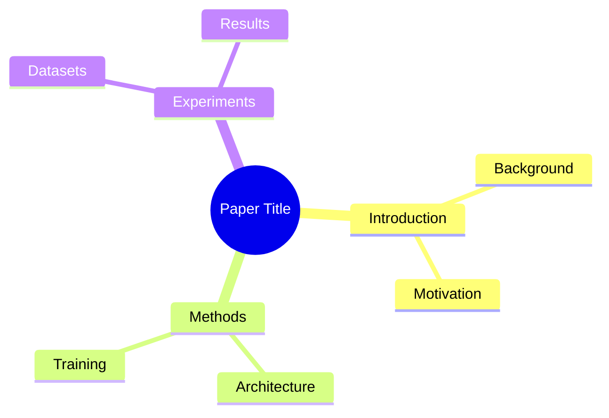
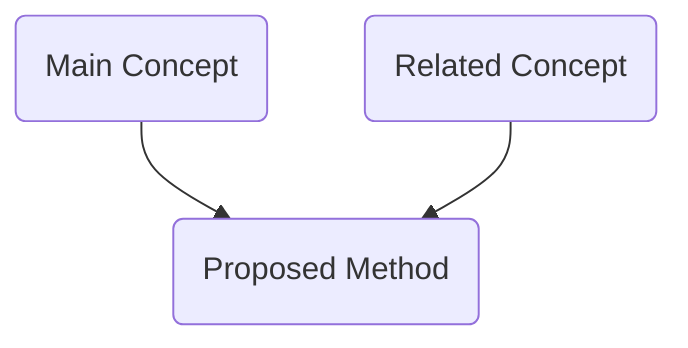

# Paper Mind Graph Integration Guide

## Overview

This document describes the integration of **paper_mind_graph** into PaperCircle. This integration enables AI-powered analysis of research papers, extracting structured knowledge graphs with concepts, methods, experiments, and relationships.

## Features

### 🧠 Intelligent Paper Analysis
- **Automatic extraction** of key concepts, methods, and experiments
- **Knowledge graph construction** with typed nodes and relationships
- **Figure and table linking** to relevant concepts
- **Full traceability** back to original PDF pages

### 📊 Multiple Visualizations
- **Markdown Summary**: Structured notes with all key information
- **Mind Map**: Mermaid-based hierarchical visualization
- **Flowchart**: Concept flow and dependencies
- **Interactive Graph**: D3.js-powered network visualization
- **Structured Lists**: Browsable concepts, methods, and experiments

### 🤔 Question & Answer
- **Graph-aware Q&A**: Ask questions about analyzed papers
- **Context-aware answers**: Responses include relevant sections, figures, and tables
- **Interactive sessions**: Multiple questions with conversation history

### 🎯 Session-Level Analysis
- **Multi-paper analysis**: Analyze all papers in a session at once
- **Combined insights**: Aggregate concepts and methods across papers
- **Comparative view**: See relationships between papers

## Architecture

```
┌─────────────────────────────────────────────────────────────┐
│                        User Interface                        │
│  ┌──────────────────┐         ┌─────────────────────────┐   │
│  │  PaperAnalysis   │         │  SessionAnalysisView    │   │
│  │      View        │         │                         │   │
│  └──────────────────┘         └─────────────────────────┘   │
└─────────────────┬───────────────────────┬───────────────────┘
                  │                       │
                  ▼                       ▼
┌─────────────────────────────────────────────────────────────┐
│                   FastAPI Backend                            │
│              (paper_analysis_api.py)                         │
│  ┌──────────────┐  ┌──────────────┐  ┌──────────────┐      │
│  │   Analyze    │  │   Get        │  │   Q&A        │      │
│  │   Paper      │  │   Analysis   │  │   System     │      │
│  └──────────────┘  └──────────────┘  └──────────────┘      │
└─────────────────┬───────────────────────┬───────────────────┘
                  │                       │
                  ▼                       ▼
┌─────────────────────────────────────────────────────────────┐
│                    paper_mind_graph                          │
│  ┌──────────┐  ┌──────────┐  ┌──────────┐  ┌──────────┐    │
│  │Ingestion │→ │  Graph   │→ │   Q&A    │→ │ Export   │    │
│  │          │  │ Builder  │  │          │  │          │    │
│  └──────────┘  └──────────┘  └──────────┘  └──────────┘    │
└─────────────────────────────────────────────────────────────┘
                  │
                  ▼
┌─────────────────────────────────────────────────────────────┐
│              Supabase Database                               │
│         (paper_analysis table)                               │
└─────────────────────────────────────────────────────────────┘
```

## Database Schema

### `paper_analysis` Table

```sql
CREATE TABLE paper_analysis (
  id uuid PRIMARY KEY,
  paper_id uuid REFERENCES papers(id),
  community_id uuid REFERENCES communities(id),
  session_id uuid REFERENCES sessions(id),

  -- Analysis data
  analysis_data jsonb NOT NULL,        -- Full graph JSON
  markdown_summary text,                -- Markdown notes
  mindmap_mermaid text,                 -- Mind map diagram
  flowchart_mermaid text,               -- Flowchart diagram
  html_visualization text,              -- Interactive HTML

  -- Statistics
  concepts_count int,
  methods_count int,
  experiments_count int,
  figures_count int,
  tables_count int,
  nodes_count int,
  edges_count int,

  -- Metadata
  processing_time_seconds float,
  created_by uuid REFERENCES profiles(id),
  created_at timestamptz,
  updated_at timestamptz,

  UNIQUE(paper_id, community_id, session_id)
);
```

## Setup Instructions

### 1. Run Database Migration

```bash
# The migration file is already created at:
# supabase/migrations/20251212000000_add_paper_analysis.sql

# Apply it using Supabase CLI:
npx supabase db push
```

### 2. Install Backend Dependencies

```bash
# Install Python dependencies
pip install fastapi uvicorn supabase python-dotenv pydantic

# Install paper_mind_graph requirements
pip install -r paper_mind_graph/requirements.txt
```

### 3. Configure Environment Variables

Add to your `.env` file:

```bash
# Paper Mind Graph Configuration
OLLAMA_API_BASE=http://localhost:11434
OLLAMA_MODEL=ollama_chat/qwen2.5-coder:32b

# Supabase (already configured)
VITE_SUPABASE_URL=your_supabase_url
VITE_SUPABASE_ANON_KEY=your_anon_key
```

### 4. Start the Analysis API

```bash
# Make the script executable
chmod +x start_paper_analysis_api.sh

# Start the API server
./start_paper_analysis_api.sh
```

The API will be available at `http://localhost:8001`

### 5. Install Frontend Dependencies

```bash
# Install react-mermaid2 for diagram rendering
npm install react-mermaid2 mermaid
```

### 6. Add Routes to Your App

Update `src/App.tsx` to include the analysis views:

```typescript
import { PaperAnalysisView } from './components/Papers/PaperAnalysisView';
import { SessionAnalysisView } from './components/Sessions/SessionAnalysisView';

// Use in your routing or modal system
```

## Usage

### Analyzing a Single Paper

```typescript
import { PaperAnalysisView } from './components/Papers/PaperAnalysisView';

<PaperAnalysisView
  paperId="paper-uuid"
  communityId="optional-community-uuid"
  sessionId="optional-session-uuid"
/>
```

### Analyzing Session Papers

```typescript
import { SessionAnalysisView } from './components/Sessions/SessionAnalysisView';

<SessionAnalysisView
  sessionId="session-uuid"
  communityId="optional-community-uuid"
/>
```

### API Endpoints

#### Analyze a Paper
```bash
POST /analyze/paper
{
  "paper_id": "uuid",
  "community_id": "uuid",  # optional
  "session_id": "uuid",    # optional
  "force_reanalyze": false
}
```

#### Analyze All Session Papers
```bash
POST /analyze/session
{
  "session_id": "uuid",
  "community_id": "uuid",  # optional
  "force_reanalyze": false
}
```

#### Get Analysis
```bash
GET /analysis/paper/{paper_id}?community_id=uuid&session_id=uuid
GET /analysis/session/{session_id}
GET /analysis/{analysis_id}
```

#### Ask Question
```bash
POST /ask
{
  "analysis_id": "uuid",
  "question": "What are the main contributions?"
}
```

## User Flow

### 1. Select Circle & Session
User navigates to a circle and selects a session with papers.

### 2. Initiate Analysis
Click "Analyze Papers" button in the session view.

### 3. Processing
Backend processes each paper through paper_mind_graph:
- Downloads/caches PDF
- Extracts structure (sections, figures, tables)
- Builds knowledge graph using LLM
- Generates visualizations
- Saves to database

**Note**: Analysis takes 2-5 minutes per paper depending on length.

### 4. View Results
Once complete, users can:
- Browse structured summaries
- Explore mind maps and flowcharts
- View extracted concepts, methods, experiments
- Interact with knowledge graph
- Ask questions about the paper

### 5. Session-Level Insights
View combined analysis across all session papers:
- Common concepts across papers
- Related methods and techniques
- Comparative experiments
- Knowledge graph connections

## Visualization Examples

### Mind Map


### Flowchart


## Advanced Features

### Custom LLM Configuration

Modify `paper_analysis_api.py`:

```python
PMG_CONFIG = Config(
    api_base="http://your-llm-endpoint",
    model_id="your-model",
    num_ctx=8192,
    max_chunk_size=1500,
)
```

### Batch Processing

Process multiple papers asynchronously:

```python
# Already implemented in /analyze/session endpoint
# Uses FastAPI BackgroundTasks for non-blocking processing
```

### Custom Extractors

Extend `paper_mind_graph` for domain-specific extraction:

```python
from paper_mind_graph.graph_builder import GraphBuilder

# Add custom node types or extraction logic
```

## Performance Considerations

### Analysis Time
- **Short papers** (5-10 pages): 2-3 minutes
- **Conference papers** (10-15 pages): 3-5 minutes
- **Long papers** (20+ pages): 5-10 minutes

### Caching
- PDFs are cached in `./paper_cache/`
- Analysis results stored in database
- Re-analysis only when forced or paper updated

### Scaling
- Background task processing prevents UI blocking
- Multiple papers analyzed concurrently
- Polling mechanism updates UI as analyses complete

## Troubleshooting

### API won't start
- Check Python dependencies: `pip install -r requirements.txt`
- Verify Ollama is running: `curl http://localhost:11434`
- Check environment variables in `.env`

### Analysis fails
- Ensure paper has valid `arxiv_id` or `pdf_url`
- Check LLM is accessible and has sufficient context window
- Review API logs for detailed error messages

### Frontend not connecting
- Verify API is running on port 8001
- Check CORS settings in `paper_analysis_api.py`
- Ensure Vite dev server allows localhost:8001

### Mermaid diagrams not rendering
- Install `react-mermaid2`: `npm install react-mermaid2 mermaid`
- Check browser console for errors
- Verify mermaid syntax in generated diagrams

## Future Enhancements

### Planned Features
- [ ] Citation network analysis across session papers
- [ ] Automated paper comparison and contradiction detection
- [ ] Export to presentation formats (slides)
- [ ] Integration with note-taking and annotation systems
- [ ] Real-time collaborative editing of knowledge graphs
- [ ] Custom extraction templates for different paper types
- [ ] Multi-language support for non-English papers

### Community Contributions
- Domain-specific extractors (medical, physics, CS theory, etc.)
- Alternative visualization libraries
- Enhanced Q&A with citation verification
- Integration with reference managers (Zotero, Mendeley)

## Support

For issues or questions:
1. Check the paper_mind_graph documentation: `paper_mind_graph/README.md`
2. Review API logs for error details
3. Open an issue with reproduction steps

## License

This integration follows the MIT license of paper_mind_graph.

---

**Built with ❤️ for researchers who want to understand papers deeply.**
