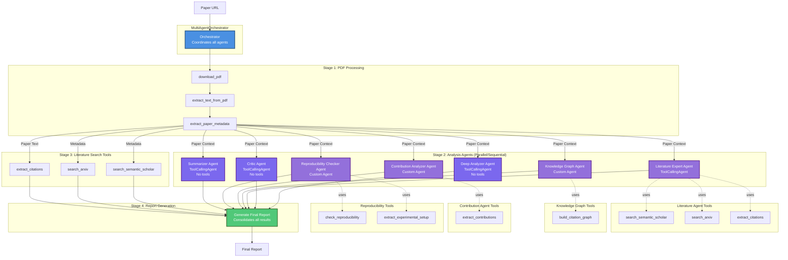

# Multi-Agent Orchestrator Architecture

This diagram shows all agents and tools involved in the Paper Review Orchestrator system.

## System Overview



## Agent Roles and Responsibilities

### 1. Deep Analyzer Agent
- **Type**: ToolCallingAgent
- **Tools**: None (uses LLM reasoning only)
- **Purpose**: Provides deep technical analysis
- **Focus**:
  - Technical novelty and approach
  - Mathematical foundations
  - Experimental methodology
  - Key insights and findings

### 2. Critic Agent
- **Type**: ToolCallingAgent
- **Tools**: None (uses LLM reasoning only)
- **Purpose**: Senior reviewer providing balanced critique
- **Focus**:
  - Genuine strengths identification
  - Specific weaknesses with suggestions
  - Probing questions
  - Novelty, clarity, and significance assessment

### 3. Literature Expert Agent
- **Type**: ToolCallingAgent
- **Tools**:
  - `search_semantic_scholar` - Search papers in Semantic Scholar
  - `search_arxiv` - Search papers in arXiv
  - `extract_citations` - Extract citations from paper text
- **Purpose**: Literature review specialist
- **Focus**:
  - Extract and analyze citations
  - Find highly relevant related work
  - Identify paper's position in the field
  - Map connections to foundational papers

### 4. Knowledge Graph Agent
- **Type**: Custom Agent (created via `create_knowledge_graph_agent`)
- **Tools**:
  - `build_citation_graph` - Build citation network
- **Purpose**: Create knowledge graph of paper relationships

### 5. Contribution Analyzer Agent
- **Type**: Custom Agent (created via `create_contribution_agent`)
- **Tools**:
  - `extract_contributions` - Extract claimed and actual contributions
- **Purpose**: Analyze and evaluate paper contributions
- **Focus**:
  - Claimed contributions
  - Actual contributions verified from content
  - Comparison with baselines
  - Significance of improvements

### 6. Reproducibility Checker Agent
- **Type**: Custom Agent (created via `create_reproducibility_checker`)
- **Tools**:
  - `check_reproducibility` - Assess reproducibility
  - `extract_experimental_setup` - Extract experimental details
- **Purpose**: Assess paper reproducibility
- **Focus**:
  - Code availability
  - Hyperparameter details
  - Training procedure
  - Dataset accessibility
  - Compute requirements
  - Reproducibility score

### 7. Summarizer Agent
- **Type**: ToolCallingAgent
- **Tools**: None (uses LLM reasoning only)
- **Purpose**: Create accessible summaries at multiple levels
- **Outputs**:
  - One-sentence summary (< 280 chars)
  - Abstract-length summary
  - Executive summary for practitioners
  - Technical summary for researchers

## Pipeline Execution Flow

### Stage 1: PDF Processing (Sequential)
```
Paper URL → download_pdf → extract_text_from_pdf → extract_paper_metadata → Paper Context
```

### Stage 2: Analysis Tasks (Parallel/Sequential)
All agents in Stage 2 can run in parallel as they have no dependencies on each other:
- Deep Analyzer
- Critic
- Literature Expert
- Knowledge Graph Builder
- Contribution Analyzer
- Reproducibility Checker
- Summarizer

### Stage 3: Literature Search (Sequential)
```
Metadata → search_semantic_scholar
Metadata → search_arxiv
Paper Text → extract_citations
```

### Stage 4: Report Generation (Sequential)
Consolidates all results from Stages 1-3 into a final markdown report

## Tool Categories

### PDF Processing Tools
- `download_pdf` - Downloads PDF from URL
- `extract_text_from_pdf` - Extracts text content from PDF
- `extract_paper_metadata` - Extracts title, abstract, authors, etc.

### Literature Search Tools
- `search_semantic_scholar` - Searches Semantic Scholar API
- `search_arxiv` - Searches arXiv API
- `extract_citations` - Extracts citations from paper text

### Analysis Tools
- `build_citation_graph` - Creates citation network graph
- `extract_contributions` - Extracts and categorizes contributions
- `check_reproducibility` - Assesses reproducibility factors
- `extract_experimental_setup` - Extracts experimental details

## Execution Modes

### Parallel Mode (default)
- Uses ThreadPoolExecutor with max 3 workers
- Independent tasks run concurrently
- Faster execution time

### Sequential Mode
- Tasks run one after another
- Useful for debugging
- Lower resource usage

## Agent Selection

The orchestrator can run:
1. **All agents** (default) - Comprehensive review
2. **Specific agents** - Targeted analysis using `agents_to_run` parameter

## Configuration

Uses `Config` object from `paper_review_system` with:
- `model_id` - LLM model to use
- `api_base` - API endpoint
- `num_ctx` - Context window size
- `max_paper_length` - Maximum paper length to process

## Output Structure

```python
{
    "paper_url": str,
    "status": "running" | "complete" | "failed",
    "stages": {
        "pdf_processing": {...},
        "deep_analyzer": {...},
        "critic": {...},
        "contribution_analyzer": {...},
        "reproducibility_checker": {...},
        "summarizer": {...},
        "literature": {...}
    },
    "final_report": str  # Markdown formatted report
}
```
