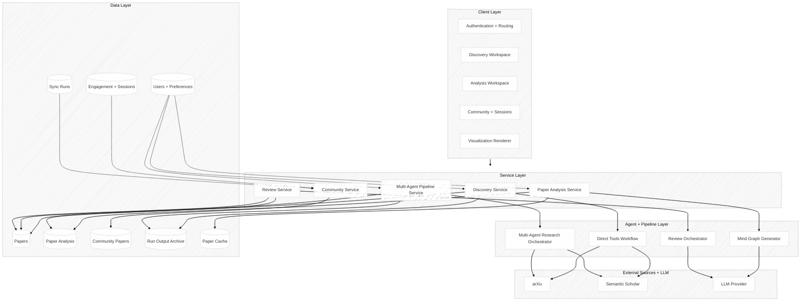
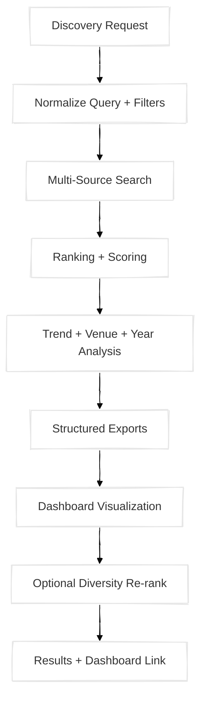
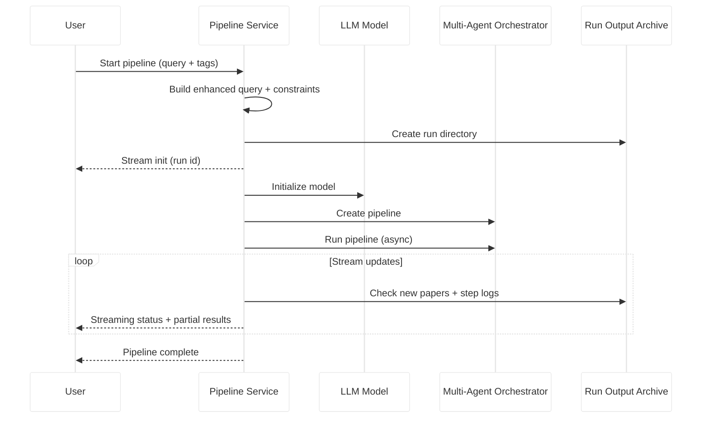
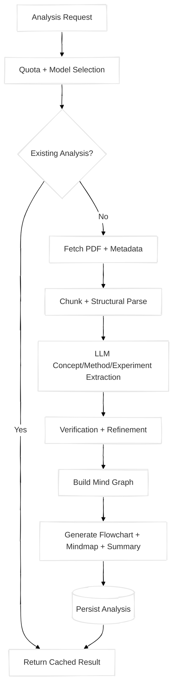
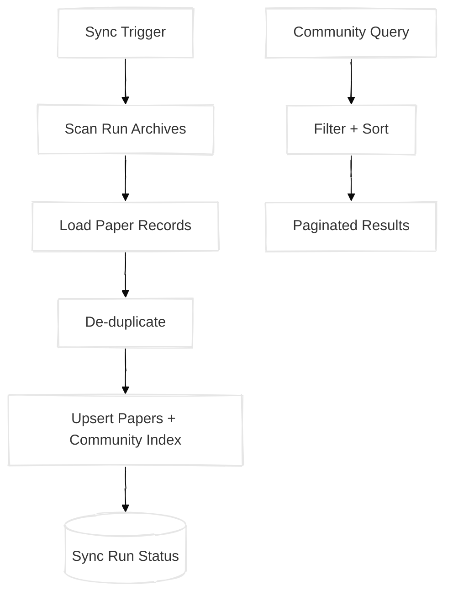
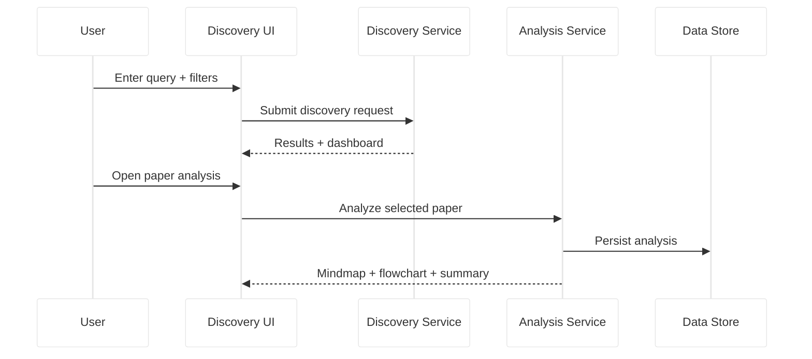

# Paper Circle Diagrams (Academic Sketch Style)

These diagrams are academic, sketch-style system figures for Paper Circle.
They avoid file names and focus on conceptual modules and flows.

## 1) Overall System Architecture (Sketch)



## 2) Full General Pipeline (End-to-End)


## 3) Individual Pipelines (Detailed, General)

### 3.1 Discovery (Direct Tools Workflow)



### 3.2 Multi-Agent Research Pipeline (Streaming)



### 3.3 Paper Analysis (Mind Graph)



### 3.4 Paper Review (Multi-Agent Reviewers)

```mermaid
%%{init: {'theme': 'base', 'themeVariables': { 'primaryColor': '#ffffff', 'edgeLabelBackground':'#fff', 'tertiaryColor': '#f4f4f4', 'fontFamily': 'Comic Sans MS'}, 'look': 'handDrawn'} }%%
stateDiagram-v2
    [*] --> Intake
    Intake --> Processing
    state Processing {
        Download --> TextExtract --> Metadata
    }
    Processing --> ParallelReview
    state ParallelReview {
        DeepAnalysis
        CriticalReview
        ContributionCheck
        Reproducibility
        Summary
    }
    ParallelReview --> LiteratureScan
    state LiteratureScan {
        ExternalSearch --> CitationMatch
    }
    LiteratureScan --> Report
    state Report {
        Compile --> StructuredReport
    }
    Report --> [*]
```

### 3.5 Community Sync + Serving



### 3.6 Frontend Discovery → Analysis Path



## 4) Usage Notes

- All labels are academic and avoid implementation-specific file names.
- The sketch look is provided via Mermaid "handDrawn" rendering.
