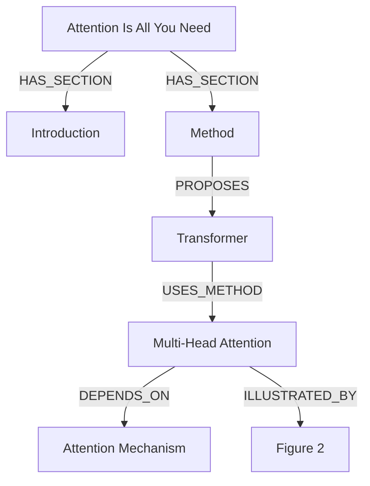

# Paper Mind Graph Architecture
## Automated Knowledge Graph Construction from Research Papers

---

## 🎯 Overview

**Paper Mind Graph** is a multi-agent system that automatically constructs **knowledge graphs** (mind maps) from research papers. It extracts concepts, methods, experiments, and their relationships, enabling:
- **Q&A over papers** (semantic search + graph traversal)
- **Coverage verification** (ensuring nothing is missed)
- **Multi-format export** (JSON, Markdown, Mermaid diagrams, HTML)

### Core Value Proposition
Instead of manually reading a paper and creating notes, the system:
1. **Parses** the PDF into structured elements (sections, figures, tables, equations)
2. **Extracts** concepts, methods, and experiments using LLM agents
3. **Links** everything into a knowledge graph
4. **Verifies** coverage to ensure completeness
5. **Enables** Q&A and export to multiple formats

---

## 📂 Directory Structure

```
paper_mind_graph/
├── __init__.py              # Public API exports
├── schema.py                # Data models (nodes, edges, graph)
├── ingestion.py             # PDF parsing & chunking
├── graph_builder.py         # Multi-agent graph construction
├── verification.py          # Coverage checking & validation
├── qa_system.py             # Question-answering over graph
├── export.py                # Export to multiple formats
├── api.py                   # High-level PaperMindGraph class
├── examples.py              # Usage examples
├── requirements.txt         # Dependencies
├── README.md                # Documentation
├── paper_cache/             # Downloaded PDFs
└── output/                  # Generated graphs & exports
```

---

## 🏗️ System Architecture

### High-Level Pipeline

```
┌─────────────────────────────────────────────────────────────────┐
│                        INPUT: Research Paper                     │
│             (arXiv URL, DOI, or local PDF path)                  │
└────────────────────────────┬────────────────────────────────────┘
                             │
                             ▼
┌─────────────────────────────────────────────────────────────────┐
│                    STAGE 1: INGESTION                            │
│                    (ingestion.py)                                │
│  ┌───────────────────────────────────────────────────────────┐  │
│  │  1. Download PDF (if URL)                                 │  │
│  │  2. Parse PDF structure                                   │  │
│  │     - Extract metadata (title, authors, abstract)         │  │
│  │     - Identify sections/subsections                       │  │
│  │     - Extract figures with captions                       │  │
│  │     - Extract tables with captions                        │  │
│  │     - Extract equations (LaTeX)                           │  │
│  │  3. Semantic chunking                                     │  │
│  │     - Split into coherent chunks (~1500 chars)            │  │
│  │     - Track source locations (page, bbox)                 │  │
│  │     - Generate embeddings (optional)                      │  │
│  └───────────────────────────────────────────────────────────┘  │
│                                                                  │
│  Output: MindGraph (structured paper data)                      │
└────────────────────────────┬────────────────────────────────────┘
                             │
                             ▼
┌─────────────────────────────────────────────────────────────────┐
│                  STAGE 2: GRAPH BUILDING                         │
│                  (graph_builder.py)                              │
│  ┌───────────────────────────────────────────────────────────┐  │
│  │  Multi-Agent Extraction:                                  │  │
│  │                                                           │  │
│  │  Agent 1: ConceptExtractor                                │  │
│  │    - Identifies key concepts/definitions                  │  │
│  │    - Creates CONCEPT nodes                                │  │
│  │    - Classifies: core, supporting, background             │  │
│  │                                                           │  │
│  │  Agent 2: MethodExtractor                                 │  │
│  │    - Identifies algorithms/techniques                     │  │
│  │    - Creates METHOD nodes                                 │  │
│  │    - Classifies: proposed, baseline, component            │  │
│  │                                                           │  │
│  │  Agent 3: ExperimentExtractor                             │  │
│  │    - Identifies experimental setups                       │  │
│  │    - Creates EXPERIMENT, DATASET, RESULT nodes            │  │
│  │    - Links experiments to datasets/metrics                │  │
│  │                                                           │  │
│  │  Agent 4: LinkageAgent                                    │  │
│  │    - Creates semantic edges between nodes                 │  │
│  │    - Links figures/tables to concepts                     │  │
│  │    - Identifies dependencies & relationships              │  │
│  └───────────────────────────────────────────────────────────┘  │
│                                                                  │
│  Output: MindGraph with nodes + edges                           │
└────────────────────────────┬────────────────────────────────────┘
                             │
                             ▼
┌─────────────────────────────────────────────────────────────────┐
│                  STAGE 3: VERIFICATION                           │
│                  (verification.py)                               │
│  ┌───────────────────────────────────────────────────────────┐  │
│  │  CoverageChecker:                                         │  │
│  │    - Checks all sections covered                          │  │
│  │    - Checks all figures/tables linked                     │  │
│  │    - Identifies orphaned nodes                            │  │
│  │    - Generates coverage report                            │  │
│  │                                                           │  │
│  │  VerificationManager:                                     │  │
│  │    - Verifies node quality                                │  │
│  │    - Checks edge validity                                 │  │
│  │    - Flags low-confidence items                           │  │
│  └───────────────────────────────────────────────────────────┘  │
│                                                                  │
│  Output: CoverageReport + verification status                   │
└────────────────────────────┬────────────────────────────────────┘
                             │
                             ▼
┌─────────────────────────────────────────────────────────────────┐
│                  STAGE 4: Q&A & EXPORT                           │
│              (qa_system.py + export.py)                          │
│  ┌───────────────────────────────────────────────────────────┐  │
│  │  PaperQA:                                                 │  │
│  │    - Graph-based retrieval                                │  │
│  │    - Semantic search over chunks                          │  │
│  │    - Context assembly from graph                          │  │
│  │    - LLM-powered answer generation                        │  │
│  │                                                           │  │
│  │  GraphExporter:                                           │  │
│  │    - JSON (full graph data)                               │  │
│  │    - Markdown (human-readable notes)                      │  │
│  │    - Mermaid (diagram code)                               │  │
│  │    - HTML (interactive visualization)                     │  │
│  └───────────────────────────────────────────────────────────┘  │
│                                                                  │
│  Output: Answers + exported files                               │
└─────────────────────────────────────────────────────────────────┘
```

---

## 📊 Data Schema (schema.py)

### Core Graph Elements

#### **1. GraphNode**
```python
@dataclass
class GraphNode:
    id: str                      # Unique identifier
    type: NodeType               # CONCEPT, METHOD, EXPERIMENT, etc.
    title: str                   # Short name
    description: str             # Detailed explanation

    # Source tracking
    source_chunks: List[str]     # Which chunks mention this
    origin_pages: List[int]      # Which pages it appears on
    source_locations: List[SourceLocation]  # Precise locations

    # Special fields
    label: str                   # "Figure 3", "Table 1"
    caption: str                 # For figures/tables
    image_path: str              # Path to figure image
    latex: str                   # For equations

    # Verification
    verification_status: VerificationStatus
    confidence: float            # 0.0-1.0
    created_at: str
    modified_at: str
    properties: Dict             # Extensible metadata
```

#### **2. GraphEdge**
```python
@dataclass
class GraphEdge:
    id: str
    type: EdgeType               # DEFINES, USES_METHOD, etc.
    source_id: str               # Source node ID
    target_id: str               # Target node ID

    label: str                   # Optional description
    reason: str                  # Why this edge exists
    weight: float                # Edge importance

    source_chunks: List[str]     # Evidence for this edge
    verification_status: VerificationStatus
    confidence: float
```

#### **3. Node Types (14 types)**
```python
class NodeType(Enum):
    PAPER = "paper"              # Root node
    SECTION = "section"          # Sections/subsections
    CONCEPT = "concept"          # Key ideas, definitions
    METHOD = "method"            # Algorithms, architectures
    EXPERIMENT = "experiment"    # Experimental setups
    FIGURE = "figure"            # Figures
    TABLE = "table"              # Tables
    EQUATION = "equation"        # Math equations
    DATASET = "dataset"          # Datasets
    TASK = "task"                # Tasks/benchmarks
    RESULT = "result"            # Findings
    LIMITATION = "limitation"    # Limitations
    FUTURE_WORK = "future_work"  # Future directions
    REFERENCE = "reference"      # Citations
```

#### **4. Edge Types (15 types)**
```python
class EdgeType(Enum):
    # Structural
    HAS_SECTION = "has_section"
    HAS_SUBSECTION = "has_subsection"

    # Content
    DEFINES = "defines"
    USES_METHOD = "uses_method"
    PROPOSES = "proposes"
    EVALUATES_ON = "evaluates_on"

    # Visual/Reference
    ILLUSTRATED_BY = "illustrated_by"
    SUMMARIZED_BY = "summarized_by"
    DERIVED_BY = "derived_by"

    # Semantic
    DEPENDS_ON = "depends_on"
    EXTENDS = "extends"
    COMPARES_TO = "compares_to"
    SUPPORTS = "supports"
    CONTRADICTS = "contradicts"
    CITES = "cites"
```

### Example Graph Structure

```
Paper: "Attention Is All You Need"
    │
    ├─[HAS_SECTION]→ Introduction
    │   └─[DEFINES]→ Concept: "Sequence Transduction"
    │
    ├─[HAS_SECTION]→ Method
    │   ├─[PROPOSES]→ Method: "Transformer"
    │   │   ├─[USES_METHOD]→ Method: "Multi-Head Attention"
    │   │   │   └─[ILLUSTRATED_BY]→ Figure: "Figure 2"
    │   │   └─[DEPENDS_ON]→ Concept: "Attention Mechanism"
    │   │
    │   └─[DEFINES]→ Equation: "Attention(Q,K,V)"
    │
    └─[HAS_SECTION]→ Experiments
        ├─[EVALUATES_ON]→ Dataset: "WMT 2014 EN-DE"
        ├─[SUMMARIZED_BY]→ Table: "Table 2"
        └─[COMPARES_TO]→ Method: "LSTM baseline"
```

---

## 🔬 Multi-Agent Graph Construction

### Agent Architecture (graph_builder.py)

```
GraphBuilder (Orchestrator)
    ├── ConceptExtractor (Agent 1)
    ├── MethodExtractor (Agent 2)
    ├── ExperimentExtractor (Agent 3)
    └── LinkageAgent (Agent 4)
```

### Agent 1: ConceptExtractor

**Purpose:** Extract key concepts and definitions

**Prompts:**
```
You are an expert at extracting key concepts from research papers.

For each text chunk, identify the main CONCEPTS being defined or discussed.

A concept is:
- A key idea, definition, or term
- A theoretical framework or paradigm
- A named technique or approach
- A specific phenomenon or effect

Output JSON with: name, description, type, importance
```

**Process:**
1. Receives text chunks from ingestion
2. Runs LLM (CodeAgent) to identify concepts
3. Creates CONCEPT nodes with:
   - Name (short, 2-5 words)
   - Description (1-2 sentences)
   - Type: "definition", "technique", "theory", "phenomenon"
   - Importance: "core", "supporting", "background"

**Example Output:**
```json
{
  "concepts": [
    {
      "name": "Attention Mechanism",
      "description": "A neural network component that computes weighted sums of values based on query-key similarities.",
      "type": "technique",
      "importance": "core"
    }
  ]
}
```

---

### Agent 2: MethodExtractor

**Purpose:** Extract methods, algorithms, and techniques

**Prompts:**
```
You are an expert at identifying methods, algorithms, and techniques.

For each text, identify:
- Proposed methods/algorithms
- Baseline methods mentioned
- Techniques used in the approach

Output JSON with: name, description, category, key_steps
```

**Process:**
1. Identifies methods in chunks
2. Creates METHOD nodes with:
   - Name (as it appears in paper)
   - Description (what it does)
   - Category: "proposed", "baseline", "component"
   - Key steps (if described)

**Example Output:**
```json
{
  "methods": [
    {
      "name": "Transformer",
      "description": "Attention-based encoder-decoder architecture without recurrence.",
      "category": "proposed",
      "key_steps": [
        "Input embedding",
        "Multi-head attention",
        "Feed-forward network",
        "Output projection"
      ]
    }
  ]
}
```

---

### Agent 3: ExperimentExtractor

**Purpose:** Extract experimental setups, datasets, and results

**Process:**
1. Identifies experimental details
2. Creates nodes:
   - EXPERIMENT (experimental setup)
   - DATASET (datasets used)
   - RESULT (key findings)
   - TASK (evaluation tasks)

**Example Output:**
```json
{
  "experiments": [
    {
      "name": "WMT 2014 EN-DE Translation",
      "setup": "Trained on 4.5M sentence pairs with BPE tokenization",
      "datasets": ["WMT 2014 EN-DE"],
      "metrics": ["BLEU"],
      "key_results": ["28.4 BLEU, new SOTA"]
    }
  ],
  "datasets": [
    {
      "name": "WMT 2014 EN-DE",
      "description": "English-German machine translation benchmark"
    }
  ]
}
```

---

### Agent 4: LinkageAgent

**Purpose:** Create semantic edges between nodes

**Process:**
1. Analyzes all extracted nodes
2. Identifies relationships:
   - DEPENDS_ON: Concept A requires understanding Concept B
   - USES_METHOD: Experiment uses a specific method
   - EXTENDS: Method extends another method
   - ILLUSTRATED_BY: Concept explained by a figure
   - COMPARES_TO: Method compared to baseline
3. Creates edges with confidence scores

**Example:**
```python
# Linking a method to a figure
create_edge(
    source_id="method_transformer",
    target_id="figure_2",
    type=EdgeType.ILLUSTRATED_BY,
    reason="Figure 2 shows the Transformer architecture",
    confidence=0.95
)

# Linking concept dependency
create_edge(
    source_id="concept_multihead_attention",
    target_id="concept_scaled_dot_product",
    type=EdgeType.DEPENDS_ON,
    reason="Multi-head attention uses scaled dot-product as its core operation",
    confidence=0.98
)
```

---

## 📥 Ingestion Pipeline (ingestion.py)

### Components

#### 1. **PDFParser**
- Downloads PDFs from URLs (arXiv, DOI)
- Extracts metadata using PyMuPDF/pdfplumber
- Identifies document structure:
  - **Sections:** Uses heading detection (font size, style)
  - **Figures:** Extracts images + captions
  - **Tables:** Extracts table content + captions
  - **Equations:** Detects LaTeX equations

#### 2. **SemanticChunker**
- Splits paper into coherent chunks
- Chunk size: ~1500 characters (configurable)
- Preserves semantic boundaries (doesn't split mid-sentence)
- Tracks source locations (page, bounding box)

#### 3. **IngestionPipeline**
```python
def ingest(self, paper_source: str) -> MindGraph:
    # 1. Download PDF
    pdf_path = download_pdf(paper_source, self.cache_dir)

    # 2. Parse structure
    metadata = extract_metadata(pdf_path)
    sections = extract_sections(pdf_path)
    figures = extract_figures(pdf_path)
    tables = extract_tables(pdf_path)
    equations = extract_equations(pdf_path)

    # 3. Chunk for retrieval
    chunks = semantic_chunk(sections, max_size=1500)

    # 4. Create MindGraph
    return MindGraph(
        paper_id=generate_id(metadata.title),
        metadata=metadata,
        sections=sections,
        figures=figures,
        tables=tables,
        equations=equations,
        chunks=chunks
    )
```

---

## ✅ Verification System (verification.py)

### CoverageChecker

**Purpose:** Ensure nothing is missed

**Checks:**
1. **Section Coverage**
   - All sections have nodes
   - All subsections represented

2. **Figure/Table Coverage**
   - All figures linked to concepts/methods
   - All tables linked to results

3. **Orphan Detection**
   - Nodes with no incoming edges (except root)
   - Nodes with no outgoing edges

4. **Chunk Coverage**
   - All chunks referenced by at least one node
   - No important text ignored

**Output:** CoverageReport
```python
@dataclass
class CoverageReport:
    total_sections: int
    covered_sections: int

    total_figures: int
    linked_figures: int
    unlinked_figures: List[str]

    total_tables: int
    linked_tables: int
    unlinked_tables: List[str]

    orphan_nodes: List[str]

    coverage_percentage: float
    status: CoverageStatus  # COMPLETE, PARTIAL, POOR
```

### VerificationManager

**Purpose:** Validate node/edge quality

**Checks:**
1. **Confidence Thresholds**
   - Flags nodes with confidence < 0.7
   - Flags edges with confidence < 0.6

2. **Consistency**
   - No duplicate nodes (same concept mentioned twice)
   - No contradictory edges

3. **Completeness**
   - Core concepts identified
   - Main method described
   - Key results extracted

---

## 🔍 Q&A System (qa_system.py)

### Architecture

```
PaperQA
    ├── GraphRetriever (graph-based search)
    ├── EmbeddingStore (semantic search)
    └── LLM (answer generation)
```

### Query Flow

```
User Question: "What is the main contribution?"
    ↓
1. GraphRetriever
   - Find relevant nodes (type=CONCEPT, importance=core)
   - Traverse edges (PROPOSES, DEFINES)
   - Collect connected nodes
    ↓
2. EmbeddingStore
   - Semantic search over chunks
   - Find top-k similar chunks
    ↓
3. Context Assembly
   - Combine graph nodes + chunks
   - Include figures/tables mentioned
   - Add source locations
    ↓
4. LLM Answer Generation
   - Prompt with context
   - Generate answer
   - Cite sources (page numbers, figures)
```

### Example

**Question:** "How does multi-head attention work?"

**Graph Retrieval:**
- Find node: METHOD "Multi-Head Attention"
- Traverse: DEPENDS_ON → CONCEPT "Scaled Dot-Product Attention"
- Traverse: ILLUSTRATED_BY → FIGURE "Figure 2"
- Traverse: DERIVED_BY → EQUATION "Equation 1"

**Context Assembly:**
```
Context:
- Node: Multi-Head Attention (Method)
  Description: Applies multiple attention heads in parallel...

- Depends on: Scaled Dot-Product Attention (Concept)
  Description: Computes attention(Q,K,V) = softmax(QK^T/√d)V

- Illustrated by: Figure 2 (page 3)
  Caption: Multi-head attention architecture

- Derived by: Equation 1 (page 3)
  LaTeX: MultiHead(Q,K,V) = Concat(head_1,...,head_h)W^O
```

**Generated Answer:**
```
Multi-head attention (page 3) applies multiple attention mechanisms in parallel,
each learning different representation subspaces. It uses scaled dot-product
attention as its core operation (Equation 1), computing attention weights via
softmax(QK^T/√d). The outputs from h parallel heads are concatenated and
linearly projected. Figure 2 illustrates this architecture.
```

---

## 📤 Export System (export.py)

### Supported Formats

#### 1. **JSON Export**
```json
{
  "paper_id": "attention_is_all_you_need",
  "metadata": {...},
  "nodes": [
    {
      "id": "concept_attention",
      "type": "concept",
      "title": "Attention Mechanism",
      "description": "...",
      "source_pages": [1, 3, 5]
    }
  ],
  "edges": [
    {
      "source_id": "method_transformer",
      "target_id": "concept_attention",
      "type": "uses_method"
    }
  ]
}
```

#### 2. **Markdown Export**
```markdown
# Attention Is All You Need

## Key Concepts

### Attention Mechanism (p. 1-3)
A neural network component that computes weighted sums...

Depends on: Scaled Dot-Product Attention

## Methods

### Transformer (p. 3-5)
Encoder-decoder architecture using self-attention...

Illustrated by: Figure 2

## Experiments

### WMT 2014 EN-DE Translation (p. 7)
- Dataset: WMT 2014 EN-DE
- Metric: BLEU
- Result: 28.4 BLEU (SOTA)
```

#### 3. **Mermaid Diagram Export**


#### 4. **HTML Interactive Export**
- Interactive node graph (D3.js or Cytoscape.js)
- Clickable nodes show details
- Filterable by node type
- Searchable

---

## 🔧 API Usage (api.py)

### Quick Start

```python
from paper_mind_graph import PaperMindGraph

# 1. Create from arXiv URL
pmg = PaperMindGraph("https://arxiv.org/abs/1706.03762")

# 2. Ask questions
answer = pmg.ask("What is the main contribution?")
print(answer)
# > "The main contribution is the Transformer architecture,
#    which relies entirely on self-attention mechanisms..."

# 3. Find where something is discussed
locations = pmg.locate("attention mechanism")
print(locations)
# > [{"page": 1, "section": "Introduction"},
#     {"page": 3, "section": "Multi-Head Attention", "figure": "Figure 2"}]

# 4. Check coverage
report = pmg.check_coverage()
print(f"Coverage: {report.coverage_percentage:.1f}%")
print(f"Unlinked figures: {report.unlinked_figures}")

# 5. Export
pmg.export("markdown", "transformer_notes.md")
pmg.export("mermaid", "transformer_diagram.mmd")
pmg.export("html", "transformer_viz.html")
```

### Advanced Usage

```python
from paper_mind_graph import Config, PaperMindGraph

# Custom configuration
config = Config(
    api_base="http://localhost:11434",
    model_id="ollama_chat/qwen3-coder:30b",
    max_chunk_size=2000,
    extract_concepts=True,
    extract_methods=True,
    extract_experiments=True,
    link_figures=True,
    top_k_retrieval=10
)

pmg = PaperMindGraph(
    paper_source="path/to/paper.pdf",
    config=config,
    verbose=True
)

# Get specific node types
concepts = pmg.get_nodes(type="concept", importance="core")
methods = pmg.get_nodes(type="method", category="proposed")

# Graph traversal
attention_node = pmg.find_node("Multi-Head Attention")
dependencies = pmg.get_dependencies(attention_node)
illustrations = pmg.get_illustrations(attention_node)

# Save/load graphs
pmg.save("transformer_graph.json")
pmg2 = PaperMindGraph.load("transformer_graph.json")
```

---

## 🎯 Use Cases

### 1. **Literature Review**
```python
papers = [
    "https://arxiv.org/abs/1706.03762",  # Transformer
    "https://arxiv.org/abs/1810.04805",  # BERT
    "https://arxiv.org/abs/2005.14165",  # GPT-3
]

graphs = [PaperMindGraph(p) for p in papers]

# Compare methods
for g in graphs:
    methods = g.get_nodes(type="method", category="proposed")
    print(f"{g.metadata.title}: {[m.title for m in methods]}")
```

### 2. **Paper Summarization**
```python
pmg = PaperMindGraph("paper.pdf")

summary = {
    "contributions": pmg.ask("What are the main contributions?"),
    "methods": pmg.ask("What methods are proposed?"),
    "results": pmg.ask("What are the key experimental results?"),
    "limitations": pmg.ask("What are the limitations?")
}

pmg.export("markdown", "summary.md", template=summary)
```

### 3. **Concept Mapping**
```python
pmg = PaperMindGraph("paper.pdf")

# Find all concepts and their relationships
concepts = pmg.get_nodes(type="concept")
concept_map = {}

for c in concepts:
    concept_map[c.title] = {
        "depends_on": pmg.get_related(c, edge_type="depends_on"),
        "used_by": pmg.get_related(c, edge_type="uses_method", reverse=True),
        "pages": c.origin_pages
    }

# Export as interactive map
pmg.export("html", "concept_map.html", data=concept_map)
```

---

## 🔄 Workflow Example

### Complete Pipeline

```python
from paper_mind_graph import PaperMindGraph

# Step 1: Load paper
print("Loading paper...")
pmg = PaperMindGraph("https://arxiv.org/abs/1706.03762", verbose=True)

# Output:
# 📄 Loading paper: https://arxiv.org/abs/1706.03762
# 📥 Step 1: Ingesting PDF...
#    Title: Attention Is All You Need
#    Pages: 15
#    Sections: 8
#    Figures: 7
#    Tables: 2
#    Chunks: 45
# 🔬 Step 2: Building mind graph...
#    [ConceptExtractor] Processing 45 chunks...
#    [ConceptExtractor] Extracted 23 concepts
#    [MethodExtractor] Extracted 8 methods
#    [ExperimentExtractor] Extracted 4 experiments
#    [LinkageAgent] Creating edges...
#    [LinkageAgent] Created 67 edges
# ✅ Paper loaded successfully!
# 📊 Graph Summary:
#    Total Nodes: 42
#    - Concepts: 23
#    - Methods: 8
#    - Experiments: 4
#    Total Edges: 67

# Step 2: Verify coverage
print("\nChecking coverage...")
report = pmg.check_coverage()
print(f"Coverage: {report.coverage_percentage:.1f}%")
print(f"Unlinked figures: {len(report.unlinked_figures)}")

# Step 3: Ask questions
print("\nAsking questions...")
q1 = pmg.ask("What is the Transformer?")
q2 = pmg.ask("How does multi-head attention work?")
q3 = pmg.ask("What datasets were used for evaluation?")

# Step 4: Export
print("\nExporting...")
pmg.export("markdown", "transformer_notes.md")
pmg.export("mermaid", "transformer_diagram.mmd")
pmg.export("json", "transformer_graph.json")
pmg.export("html", "transformer_viz.html")

print("✅ Done!")
```

---

## 🧪 Testing & Evaluation

### Coverage Metrics

```python
# Expected coverage for well-structured papers
ideal_coverage = {
    "sections": 100%,      # All sections have nodes
    "figures": 90-100%,    # Most figures linked
    "tables": 90-100%,     # Most tables linked
    "chunks": 80-90%,      # Most text referenced
    "orphan_nodes": <5%    # Few isolated nodes
}

# Verification thresholds
quality_thresholds = {
    "node_confidence": 0.7,   # Min confidence for nodes
    "edge_confidence": 0.6,   # Min confidence for edges
    "core_concepts": >=3,     # Must extract core concepts
    "methods": >=1,           # Must extract at least one method
}
```

---

## 📊 Performance Characteristics

### Latency (for typical 10-page paper)

```
Ingestion:        5-10s  (PDF parsing + chunking)
Graph Building:   30-60s (LLM extraction, ~50 chunks)
  - Concepts:     10-15s
  - Methods:      8-12s
  - Experiments:  5-8s
  - Linkage:      7-10s
Verification:     2-3s
Total:            40-75s

Q&A per query:    3-5s (retrieval + generation)
Export:           1-2s per format
```

### Scalability

- **Short papers (5 pages):** ~30s total
- **Medium papers (10 pages):** ~60s total
- **Long papers (20+ pages):** ~120s total

Bottleneck: LLM calls for extraction (linear with chunk count)

---

## 🎓 Key Innovations

### 1. **Multi-Agent Extraction**
Instead of a single LLM call, specialized agents focus on:
- Concepts (definitions, theories)
- Methods (algorithms, techniques)
- Experiments (setups, results)
- Linkage (relationships)

**Benefit:** Higher quality, more structured output

### 2. **Source Tracking**
Every node and edge tracks:
- Which chunks mention it
- Which pages it appears on
- Precise bounding boxes in PDF

**Benefit:** Verifiable, traceable, citable

### 3. **Coverage Verification**
Automated checking ensures:
- No sections missed
- All figures/tables linked
- No orphan nodes

**Benefit:** Completeness guarantee

### 4. **Graph-Based Retrieval**
Q&A combines:
- Graph traversal (structured knowledge)
- Semantic search (free-text chunks)

**Benefit:** Better answers than pure semantic search

### 5. **Multi-Format Export**
Single graph → multiple outputs:
- JSON (data)
- Markdown (notes)
- Mermaid (diagrams)
- HTML (interactive)

**Benefit:** Flexibility for different use cases

---

## 🔮 Future Enhancements

### Planned Features

1. **Multi-Paper Graphs**
   - Cross-paper concept linking
   - Citation graph integration
   - Comparative analysis

2. **Interactive Editing**
   - Web UI for manual corrections
   - Human-in-the-loop verification
   - Collaborative annotation

3. **Advanced Querying**
   - Graph query language
   - Complex traversals
   - Subgraph extraction

4. **Incremental Updates**
   - Add new papers to existing graph
   - Version control for graphs
   - Diff visualization

---

## 📚 Summary

**Paper Mind Graph** is a comprehensive system for turning research papers into queryable knowledge graphs. The architecture consists of:

1. **Ingestion:** PDF parsing → structured elements + chunks
2. **Graph Building:** Multi-agent extraction → nodes + edges
3. **Verification:** Coverage checking → completeness
4. **Q&A:** Graph + semantic retrieval → answers
5. **Export:** Multiple formats → reusable outputs

**Core Value:**
- Automates the tedious work of reading and note-taking
- Creates structured, queryable knowledge
- Enables semantic Q&A over papers
- Exports to multiple formats for different workflows

**Target Users:**
- Researchers doing literature reviews
- Students learning from papers
- Developers building on prior work
- Teams collaborating on paper analysis
