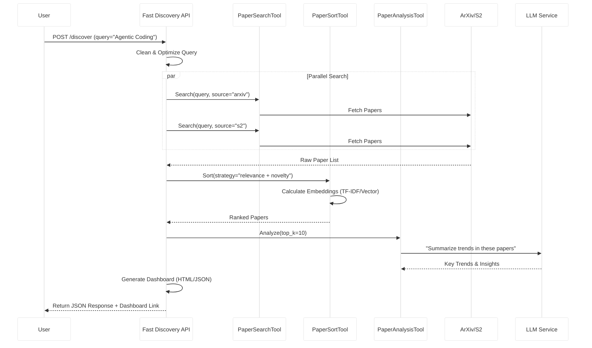
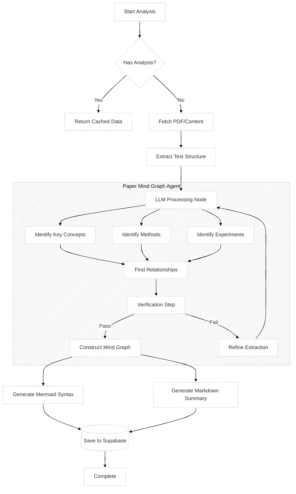
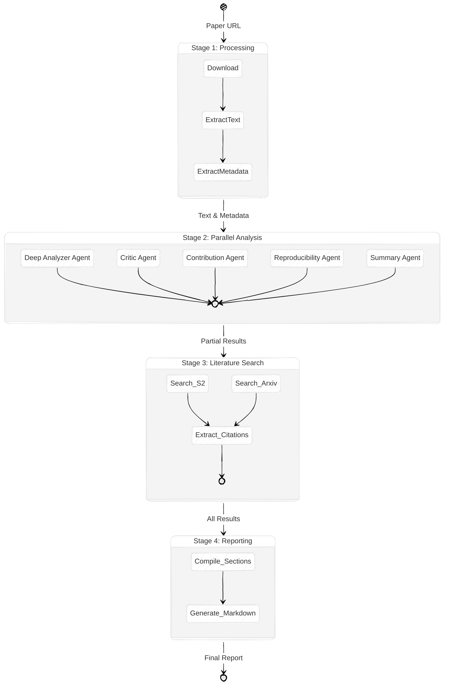
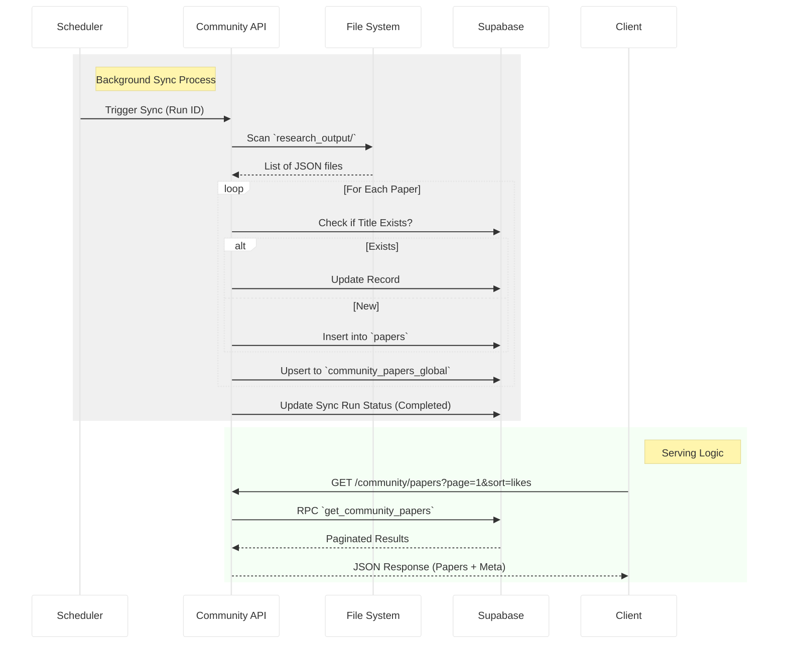

# Paper Circle System Diagrams

## 0. Visual System Concept (Sketch Visualization)

Below is a high-fidelity visual sketch illustrating the core concept of the Paper Circle ecosystem, including the AI Orchestrator, Community Circles, and the Data Core.


---

## 1. Master System Architecture (Detailed Sketch)

This comprehensive diagram maps the entire application code structure, data flow, and infrastructure.

```mermaid
%%{init: {'theme': 'base', 'themeVariables': { 'primaryColor': '#ffffff', 'edgeLabelBackground':'#fff', 'tertiaryColor': '#f4f4f4', 'fontFamily': 'Comic Sans MS'}, 'look': 'handDrawn'} }%%
graph TB
    subgraph Client_Side ["🖥️ Client Side (React/Vite)"]
        direction TB
        
        subgraph Routing ["Router Layer"]
            App[App.tsx]
            AuthCtx[AuthContext]
        end
        
        subgraph Views ["Main Views"]
            Dashboard[DashboardView]
            Discovery[AIDiscoveryView]
            AnalysisHub[AnalysisHubView]
            CommPapers[CommunityPapersTab]
        end
        
        subgraph Components ["Critical Components"]
            GraphViz[InteractiveGraph.tsx]
            MermaidViz[PaperAnalysisView\n(Mermaid Renderer)]
            PaperCard[PaperCard.tsx]
            SearchTags[SearchTagsSelector]
        end
        
        subgraph Hooks ["Data Hooks"]
            useEngagement[usePaperEngagement]
            useSession[useSessionAnalysis]
        end
    end

    subgraph Server_Side ["⚙️ Server Side (FastAPI/Python)"]
        direction TB
        
        subgraph API_Gateway ["API Endpoints"]
            FastDiscoveryApi["fast_discovery_api.py\n/discover\n/enhance"]
            AnalysisApi["paper_analysis_api.py\n/analyze/paper"]
            PipelineApi["research_pipeline_api.py\n/pipeline/status"]
            CommApi["community_papers_api.py\n/community/papers"]
        end

        subgraph Core_Agents ["AI Agent Layer"]
            PMG["Paper Mind Graph\n(paper_mind_graph/)"]
            PCA["Pipeline Control\n(discovery/pca.py)"]
            Reviewer["Review Agent\n(paper_review_agents/)"]
        end
        
        subgraph Agent_Logic ["Agent Logic"]
            Ingest[ingestion.py]
            Extract[extraction.py]
            Verify[verification.py]
            Export[export.py]
            Orchestrator[orchestrator.py]
        end
    end

    subgraph Storage ["💾 Data Persistence (Supabase)"]
        direction TB
        
        Table_Papers[("Table: papers\n(id, title, abstract,\nvector_embedding)")]
        Table_Analysis[("Table: paper_analysis\n(nodes, edges,\nmermaid_syntax)")]
        Table_Users[("Table: users\n(auth_id, preferences)")]
        Table_Engage[("Table: paper_engagement\n(likes, views, saves)")]
        Table_Comm[("Table: community_papers_global")]
    end

    subgraph External ["🌐 External World"]
        ArXiv[ArXiv API]
        S2[Semantic Scholar]
        LLM[LLM Inference\n(Ollama/Gemini)]
    end

    %% Client Interactions
    App --> AuthCtx
    AuthCtx --> Dashboard
    
    Dashboard --> CommPapers
    Dashboard --> Discovery
    
    Discovery --> SearchTags
    Discovery --> PaperCard
    
    CommPapers --> AnalysisHub
    AnalysisHub --> MermaidViz
    AnalysisHub --> GraphViz
    
    %% Hook Data Flow
    PaperAnalysisView --> useEngagement
    
    %% Network Calls
    Discovery --"/discover"--> FastDiscoveryApi
    AnalysisHub --"/analyze/paper"--> AnalysisApi
    CommPapers --"/community/papers"--> CommApi
    
    %% Backend Flow
    FastDiscoveryApi --> PCA
    PCA --> ArXiv
    PCA --> S2
    
    AnalysisApi --> PMG
    PMG --> Ingest
    Ingest --> Extract
    Extract --> Verify
    Verify --> Export
    
    CommApi --> Table_Comm
    
    %% AI Processing
    Extract --"Prompt"--> LLM
    Verify --"Check"--> LLM
    
    %% Data Persistence
    useEngagement --"RPC: toggle_engagement"--> Table_Engage
    
    PCA --"Upsert Papers"--> Table_Papers
    Export --"Save Graph"--> Table_Analysis
    Reviewer --> Orchestrator
    
    Table_Papers -.-> Table_Analysis
    Table_Users -.-> Table_Engage
```

---

## 2. Full General Research Pipeline

The end-to-end flow of how research is discovered, analyzed, and synthesized.

```mermaid
%%{init: {'theme': 'base', 'themeVariables': { 'primaryColor': '#ffffff', 'edgeLabelBackground':'#fff', 'tertiaryColor': '#f4f4f4', 'fontFamily': 'Comic Sans MS'}, 'look': 'handDrawn'} }%%
flowchart LR
    User([User Query]) --> Discovery[Discovery Phase]
    
    subgraph Discovery ["Discovery Phase"]
        direction TB
        Search[Search Tools\n(ArXiv/S2)]
        Sort[Sorting Agent\n(Relevance/Novelty)]
        Filter[Filter Agent]
    end
    
    Discovery --> Analysis[Analysis Phase]
    
    subgraph Analysis ["Analysis Phase"]
        direction TB
        PDF[PDF Retrieval]
        MindGraph[Mind Graph Generation]
        Review[Critical Review]
    end
    
    Analysis --> Synthesis[Synthesis Phase]
    
    subgraph Synthesis ["Synthesis Phase"]
        direction TB
        Report[Report Generation]
        Dashboard[Interactive Dashboard]
        Viz[Visualization\n(Mermaid/D3)]
    end
    
    Synthesis --> Output([Final Insight])
    
    Search --> Sort
    Sort --> Filter
    Filter --> PDF
    PDF --> MindGraph
    PDF --> Review
    MindGraph --> Viz
    Review --> Report
    Report --> Dashboard
```

---

## 3. Detailed Individual Pipelines

### 3.1 Discovery Pipeline (Fast Discovery & Agentic Search)



### 3.2 Paper Mind Graph Pipeline (Analysis)

Logic flow within `paper_mind_graph/ingestion.py` and `extraction.py`.



### 3.3 Review Agent Pipeline (Multi-Agent Orchestrator)

Logic flow within `paper_review_agents/orchestrator.py`.



### 3.4 Community Sync & Serving Flow

Logic flow within `community_papers_api.py`.


